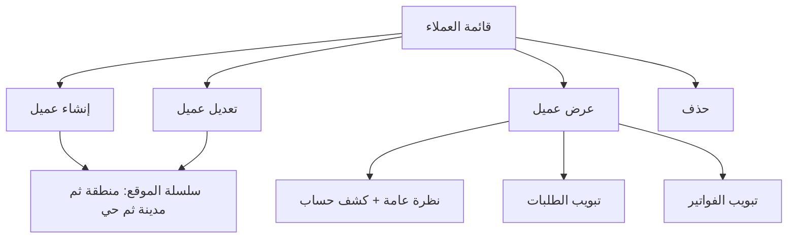

# مواصفة API العملاء (Customers / Clients)

> **الغرض:** مرجع حصرّي لشاشة العملاء — للتحقق من مواءمة تطبيق الموبايل مع الويب، ولاستخدامه في Cursor عند بناء/مراجعة الشاشات.  
> **الحالة:** ✅ منفّذ على Laravel — هذا الملف يوثّق **السلوك الفعلي** بعد مواءمة API مع الويب.  
> **مرجع عام:** [`docs/mobile-api-parity-spec.md`](mobile-api-parity-spec.md)

**مهم:** مسار الـ API هو `clients` وليس `customers`. لا تخلط مع `/api/v1/tenant/settings/clients` (مستخدمو المنشأة).

---

## 1) مرجع الويب (مصدر الحقيقة)

| الملف | الدور |
|-------|--------|
| `app/Filament/Tenant/Resources/CustomerResource.php` | قائمة، فلتر تاريخ، حذف |
| `app/Filament/Tenant/Concerns/PartyContactFormSchema.php` | فورم الإنشاء/التعديل (مشترك مع الموردين) |
| `app/Filament/Tenant/Resources/CustomerResource/Pages/ViewCustomer.php` | صفحة العرض + كشف الحساب |
| `resources/views/filament/tenant/resources/customers/partials/overview-content.blade.php` | بطاقات النظرة العامة + جدول الكشف |
| `app/Filament/Tenant/Resources/CustomerResource/RelationManagers/InvoicesRelationManager.php` | تبويب الفواتير |
| `app/Filament/Tenant/Resources/CustomerResource/RelationManagers/OrdersRelationManager.php` | تبويب الطلبات |
| `app/Services/CustomerAccountStatementService.php` | منطق كشف الحساب (يُعاد استخدامه كما هو) |

**API (لا تعدّل الويب — أعد استخدام الخدمات نفسها):**

| الملف | الدور |
|-------|--------|
| `app/Http/Controllers/API/V1/CustomerController.php` | Endpoints |
| `app/Http/Requests/StoreCustomerRequest.php` / `UpdateCustomerRequest.php` | Validation |
| `app/Http/Resources/CustomerResource.php` | Response JSON |
| `app/Services/CustomerAccountStatementService.php` | كشف الحساب |

---

## 2) الفرق: API القديم vs الويب + API الحالي

| الموضوع | API القديم | الويب + API الحالي |
|---------|------------|---------------------|
| **الهاتف** | إلزامي | **اختياري** (مثل الويب) |
| **الرمز البريدي** | يُقبل في الطلب ويُهمل في الرد | `postalCode` في الرد |
| **عنوان التوصيل** | `deliveryAddress` كان يرجّع الموقع المحسوب (مدينة/منطقة) بالخطأ | `deliveryAddress` = حقل الشارع، `location` = المنطقة/المدينة/الحي |
| **كشف الحساب** | ❌ | `GET .../clients/{id}/account-statement` |
| **نظرة عامة (بطاقات)** | ❌ | `overview` داخل `GET .../clients/{id}` |
| **فواتير العميل** | ❌ | `GET .../clients/{id}/invoices` |
| **طلبات العميل** | ❌ | `GET .../clients/{id}/orders` |
| **فلاتر القائمة** | بدون بحث/تاريخ | `search` + `from_date` + `to_date` مثل الجدول |
| **الموقع (منطقة/مدينة/حي)** | مسار المتجر فقط (`/store/location/*`) ويخفي المدن بدون أحياء | `GET .../shop/location/*` يطابق فورم الويب |
| **الحساب المحاسبي Acc4** | بعد الإنشاء `acc4Code` غالباً null | يُحمَّل بعد الإنشاء (يُنشأ تلقائياً مثل الويب) |

---

## 3) المصادقة والـ Headers

```
Authorization: Bearer {token}
Tenant-Id: {tenant_id}
Accept: application/json
Content-Language: ar|en  (اختياري)
```

**Base path:** `/api/v1/tenant/shop/`

**Response envelope (مثل باقي API):**
```json
{
  "statusCode": 200,
  "statusText": "Success",
  "message": "...",
  "data": { },
  "errors": [],
  "locale": "ar"
}
```

**تواريخ العملاء:** `Y-m-d` (مثل DatePicker الويب) — مثال `2026-01-01`.  
هذا يختلف عن بعض مسارات المتجر الأخرى التي تستخدم `d-m-Y`.

---

## 4) شاشات الويب التي يجب أن يطابقها التطبيق



### 4.1 القائمة (index)

أعمدة الويب: الرقم المرجعي، الاسم، الهاتف، عنوان التوصيل، الإيميل، عدد الطلبات، الرقم الضريبي، تاريخ الانضمام.

بحث الويب يشمل: `no`, `name`, `phone`, `delivery_address`, `email`, `trn`.  
فلتر: `created_from` / `created_until` على `created_at`.

### 4.2 الإنشاء / التعديل (نفس الفورم)

الحقول من `PartyContactFormSchema`:

| حقل الويب | Body API | إلزامي | ملاحظات |
|-----------|----------|--------|---------|
| الاسم | `name` | ✅ | فريد داخل الـ tenant (قيد API إضافي) |
| الهاتف | `phone` | ❌ | اختياري. إن وُجد: صيغة دولية، فريد داخل الـ tenant. مثال: `9665xxxxxxxx` |
| الرقم الضريبي | `trn` | ❌ | max 50 |
| الإيميل | `email` | ❌ | |
| الرمز البريدي | `postal_code` | ❌ | max 20 |
| المنطقة/المحافظة | `state_id` | ❌ | من `GET location/states` |
| المدينة | `city_id` | ❌ | تظهر فقط إذا للمنطقة مدن (`hasCities`) |
| الحي | `area_id` | ❌ | يظهر فقط إذا للمدينة أحياء (`hasAreas`) |
| عنوان التوصيل | `delivery_address` | ❌ | نص حر (الشارع) |

**لا يُرسلها التطبيق — السيرفر يولّدها:**
- `no` (رقم مرجعي 6 أرقام)
- `tenant_id`
- `acc4` (حساب مدينين عملاء — `acc3_code = 1203`)
- `auto_registered = false`

**سلوك سلسلة الموقع (إجباري مثل الويب):**
1. المستخدم يختار `state_id` → اطلب المدن → امسح `city_id` و `area_id`.
2. أظهر حقل المدينة فقط إذا رجعت المدن (`hasCities` أو القائمة غير فارغة).
3. عند تغيير المدينة → امسح `area_id`.
4. أظهر حقل الحي فقط إذا `hasAreas == true`.
5. عند التعديل: عبّئ `stateId` / `cityId` / `areaId` من `GET show` (الويب يستنتج المنطقة من المدينة إن لزم).

**لا تستخدم** `/api/v1/store/location/*` لفورم العملاء — ذلك المسار خاص بالمتجر ويخفي المدن التي ليس لها أحياء.

### 4.3 صفحة العرض (view)

ثلاث مناطق مثل الويب:

1. **بروفايل + بطاقات:** الاسم، الرقم، هاتف، إيميل، رمز بريدي، الموقع المحسوب، عنوان التوصيل، TRN، تاريخ الانضمام، رقم الحساب، عدد الطلبات، عدد الفواتير المؤكدة، إجمالي غير المسدد، الرصيد المستحق.
2. **كشف الحساب:** من/إلى + جدول (افتتاحي، مدين، دائن، رصيد، أرقام القيود/الفواتير).
3. **تبويبان:** طلبات | فواتير مبيعات (بدون إنشاء من داخل التبويب).

إذا `overview.hasAccount = false`: اعرض رسالة «لا يوجد حساب محاسبي مرتبط بهذا العميل» ولا تعرض جدول الكشف.

---

## 5) Endpoints — قائمة كاملة

| Method | Path | الوصف |
|--------|------|--------|
| `GET` | `clients` | قائمة العملاء + بحث/تاريخ |
| `POST` | `clients` | إنشاء عميل |
| `GET` | `clients/{id}` | تفاصيل + `overview` |
| `PUT` / `PATCH` | `clients/{id}` | تعديل |
| `DELETE` | `clients/{id}` | حذف (يفشل إذا السجل مستخدم) |
| `GET` | `clients/{id}/account-statement` | كشف الحساب |
| `GET` | `clients/{id}/invoices` | فواتير مبيعات العميل |
| `GET` | `clients/{id}/orders` | طلبات العميل |
| `GET` | `location/states` | مناطق الفورم |
| `GET` | `location/cities?state_id=` | مدن المنطقة |
| `GET` | `location/areas?city_id=` | أحياء المدينة |

---

## 6) GET — القائمة

```
GET /api/v1/tenant/shop/clients
```

**Query:**

| Param | مثال | الوصف |
|-------|------|--------|
| `search` | `أحمد` | like على name/phone/email/no/trn/delivery_address |
| `from_date` | `2026-01-01` | `created_at >=` |
| `to_date` | `2026-08-15` | `created_at <=` |
| `sort` | `latest` \| `oldest` | الافتراضي `latest` |
| `paginate` | `1` | اختياري |
| `per_page` | `10` | مع paginate |

**Response `data[]`:**
```json
{
  "id": 12,
  "no": "482193",
  "name": "أحمد العلي",
  "phone": "966512345678",
  "email": "ahmad@example.com",
  "trn": "300000000000003",
  "postalCode": "12345",
  "deliveryAddress": "شارع الملك فهد، مبنى 12",
  "location": "الرياض - الرياض - العليا",
  "stateId": 1,
  "cityId": 10,
  "areaId": 44,
  "state": { "id": 1, "name": "الرياض", "countryId": 1, "hasCities": true },
  "city": { "id": 10, "name": "الرياض", "stateId": 1, "hasAreas": true },
  "area": { "id": 44, "name": "العليا", "cityId": 10 },
  "acc4Code": "1203000001",
  "ordersCount": 3,
  "invoicesCount": 2,
  "createdAt": "2026-03-01 09:15:00",
  "updatedAt": "2026-03-01 09:15:00"
}
```

**Breaking change (مقصود لتصحيح باج):**  
سابقاً `deliveryAddress` كان يساوي `location`. الآن:
- `deliveryAddress` = عنوان الشارع (`delivery_address`)
- `location` = نص المنطقة − المدينة − الحي

---

## 7) POST — إنشاء

```
POST /api/v1/tenant/shop/clients
```

**Body:**
```json
{
  "name": "أحمد العلي",
  "phone": "966512345678",
  "email": "ahmad@example.com",
  "trn": "300000000000003",
  "postal_code": "12345",
  "state_id": 1,
  "city_id": 10,
  "area_id": 44,
  "delivery_address": "شارع الملك فهد، مبنى 12"
}
```

الحد الأدنى: `{ "name": "أحمد العلي" }` — مثل الويب (الاسم فقط إلزامي).

**قواعد:**
- `city_id` يجب أن يتبع `state_id` إن أُرسلا معاً.
- `area_id` يجب أن يتبع `city_id` إن أُرسلا معاً.
- الهاتف إن وُجد: سعودي `9665xxxxxxxx` أو رقم دولي صحيح. السيرفر يحذف `+`.
- الاسم فريد لكل tenant. الهاتف فريد إن وُجد.

**Response:** `201` + نفس شكل العميل. `acc4Code` يجب أن يُملأ بعد الإنشاء.

**Validation 422:** `errors` object بالمفتاح snake_case للحقل (`name`, `phone`, `city_id`, ...).

---

## 8) GET — التفاصيل + النظرة العامة

```
GET /api/v1/tenant/shop/clients/{id}
```

نفس حقول القائمة **إضافة إلى** `overview` (بطاقات صفحة العرض):

```json
{
  "id": 12,
  "name": "أحمد العلي",
  "overview": {
    "hasAccount": true,
    "accountCode": "1203000001",
    "ordersCount": 3,
    "invoicesCount": 2,
    "unpaidTotal": 450.00,
    "currentBalance": 450.00,
    "currency": "SAR"
  }
}
```

`invoicesCount` = فواتير مبيعات **مؤكدة** فقط (نفس بطاقة الويب).  
`currentBalance` > 0 يعني عليه رصيد مستحق (شارة الويب الحمراء).  
`hasAccount: false` → اعرض `overview.message` ولا تعتمد على الكشف.

---

## 9) PATCH — تعديل

```
PATCH /api/v1/tenant/shop/clients/{id}
```

نفس حقول الإنشاء. أرسل الفورم كاملاً (مثل الويب) حتى لا تبقى مدينة قديمة بعد تغيير المنطقة.

عند تغيير `state_id` أرسل `city_id: null` و `area_id: null` إن لم تُختر مدينة جديدة.

---

## 10) DELETE

```
DELETE /api/v1/tenant/shop/clients/{id}
```

- `200` حُذف.
- `400` السجل مستخدم (`record_in_use_alert`) — فواتير/طلبات مرتبطة (restrictOnDelete).
- `403` لا صلاحية حذف.

لا تعرض حذف ناجح إذا العميل عليه حركات — طابق رسالة الويب.

---

## 11) GET — كشف الحساب

```
GET /api/v1/tenant/shop/clients/{id}/account-statement?from=2026-01-01&to=2026-08-15
```

**الافتراضي (مثل الويب عند فتح الصفحة):** `from` = أول يوم في السنة الحالية، `to` = اليوم.

**Logic:** `CustomerAccountStatementService::build()` — نفس أرقام الويب.

**Response عند وجود حساب:**
```json
{
  "hasAccount": true,
  "customerName": "أحمد العلي",
  "accountCode": "1203000001",
  "from": "2026-01-01",
  "to": "2026-08-15",
  "currency": "SAR",
  "openingBalance": 100.0,
  "totalDebit": 800.0,
  "totalCredit": 450.0,
  "closingBalance": 450.0,
  "currentBalance": 450.0,
  "ordersCount": 3,
  "invoicesCount": 2,
  "unpaidTotal": 450.0,
  "lines": [
    {
      "id": 91,
      "date": "2026-03-12",
      "voucherNo": "RV-00012",
      "statement": "سند قبض ...",
      "debit": 0.0,
      "credit": 200.0,
      "balance": 300.0,
      "invoiceId": 15,
      "invoiceNo": "INV-00015"
    }
  ]
}
```

**عرض الجدول مثل الويب:**
- إذا `from` موجود و `openingBalance != 0` → صف «رصيد افتتاحي».
- لكل سطر: تاريخ، رقم السند، البيان، مدين، دائن، رصيد. `invoiceNo` رابط لشاشة فاتورة المبيعات إن وُجد.
- تذييل: مجموع المدين / الدائن / الرصيد الختامي.
- إذا `lines` فارغة: «لا توجد بنود».
- `debit`/`credit` = `0` → اعرض شرطة وليس صفراً (مثل الويب).

**بدون حساب:**
```json
{
  "hasAccount": false,
  "message": "لا يوجد حساب محاسبي مرتبط بهذا العميل."
}
```
HTTP ما زال `200`.

---

## 12) GET — فواتير العميل (تبويب)

```
GET /api/v1/tenant/shop/clients/{id}/invoices
```

نفس scope الويب: `type=sales` و `status != sale_order`.

**Query:** `status` = `confirmed` \| `cancelled`، `from_date`, `to_date`, `search` (رقم الفاتورة).

```json
{
  "id": 15,
  "no": "INV-00015",
  "orderNo": "10001234",
  "status": "confirmed",
  "settlementStatusKey": "partial",
  "settlementStatus": "مسدد جزئيا",
  "date": "2026-03-12",
  "paidAmount": 200.0,
  "paidAmountPercent": 30.77,
  "unpaidAmount": 450.0,
  "additionalCosts": 0.0,
  "invoiceTotal": 650.0,
  "currency": "SAR",
  "isPaid": false,
  "hasSalesReturn": false,
  "salesReturnsCount": 0,
  "receiptVoucherId": 8
}
```

**إجراءات التبويب (تنقل لشاشات موجودة، لا APIs جديدة):**
- عرض/تعديل الفاتورة → `GET /sales/{id}`
- مرتجع مبيعات → تدفق مرتجع المبيعات (`docs/sales-returns-api-spec.md`) مع هذه الفاتورة
- إكمال الدفع إذا `isPaid = false`:
  - إذا `receiptVoucherId` موجود → شاشة تعديل سند القبض
  - وإلا → إنشاء سند قبض مع `invoice_id`

---

## 13) GET — طلبات العميل (تبويب)

```
GET /api/v1/tenant/shop/clients/{id}/orders
```

**Query:** `status` = `new` \| `packaging` \| `delivery-in-progress` \| `completed` \| `cancelled`، `from_date`, `to_date`, `search` (رقم الطلب).

```json
{
  "id": 40,
  "no": "10001234",
  "invoiceId": 15,
  "invoiceNo": "INV-00015",
  "status": "completed",
  "statusName": "مكتمل",
  "paymentStatus": "مسدد جزئيا",
  "subTotal": 500.0,
  "discount": 0.0,
  "delivery": 25.0,
  "total": 525.0,
  "currency": "SAR",
  "couponCode": null,
  "deliveryType": "delivery",
  "deliveryAddress": "شارع الملك فهد",
  "orderDate": "2026-03-10 11:00:00",
  "deliveryDate": "2026-03-11 18:00:00"
}
```

التفاصيل الكاملة للطلب عبر `GET /orders/{id}` — انظر [`docs/orders-api-spec.md`](orders-api-spec.md).

---

## 14) الموقع — فورم العملاء (وليس المتجر)

```
GET /api/v1/tenant/shop/location/states
GET /api/v1/tenant/shop/location/cities?state_id={id}
GET /api/v1/tenant/shop/location/areas?city_id={id}
```

- بدون `state_id` / `city_id`: `data = []`.
- المدن **كلها** للمنطقة (حتى بدون أحياء) — عكس مسار المتجر.
- `hasCities` على الولاية، `hasAreas` على المدينة: اخفِ الحقل إذا `false` مثل الويب.

---

## 15) Prompt جاهز لـ Cursor (Flutter)

انسخ هذا البرومبت كما هو:

```
Implement the Customers screens to match the MyBee web app using docs/customers-api-spec.md as the single source of truth.

Web reference: Filament CustomerResource + PartyContactFormSchema + ViewCustomer (overview cards, account statement, invoices tab, orders tab).

API base: /api/v1/tenant/shop/
Auth: Bearer + Tenant-Id header.
Resource path: clients (NOT customers, NOT settings/clients).

Must implement:
1) List: search + from_date/to_date (Y-m-d) + columns matching the web table.
2) Create/Edit form: same fields as PartyContactFormSchema. name required; phone optional. Cascading location using GET location/states|cities|areas (tenant shop, NOT store/location). Hide city unless hasCities; hide area unless hasAreas. Reset child IDs on parent change.
3) View: profile + overview cards from GET clients/{id}.overview. Account statement from GET clients/{id}/account-statement with default from=start of year, to=today. Opening balance row, debit/credit/balance, invoice links. If hasAccount=false show the API message.
4) Tabs: GET clients/{id}/orders and GET clients/{id}/invoices. Do not allow creating invoices/orders from these tabs. Unpaid invoice → receipt voucher flow using receiptVoucherId.
5) Field mapping: deliveryAddress = street; location = computed city/area string. postalCode, acc4Code, stateId/cityId/areaId for form fill.

Dates for this module are Y-m-d. Reuse existing sales/orders/receipt-voucher screens instead of duplicating APIs.
Do not call /api/v1/store/location/* for this form.
```

---

## 16) ملاحظات QA

| # | سيناريو | النتيجة المتوقعة |
|---|---------|------------------|
| 1 | إنشاء عميل بالاسم فقط | `201` + `no` + `acc4Code` غير فارغ |
| 2 | إنشاء بدون هاتف | ينجح (مثل الويب) |
| 3 | إنشاء بنفس الاسم مرتين | `422` على `name` |
| 4 | مدينة لا تتبع المنطقة | `422` على `city_id` |
| 5 | قائمة `search=أحمد` | نفس نتائج بحث جدول الويب |
| 6 | `GET show` | `overview.currentBalance` = شارة الرصيد في الويب (نفس الفترة الافتراضية) |
| 7 | كشف حساب من/إلى | نفس صفوف/مجاميع صفحة العرض في الويب |
| 8 | عميل بدون Acc4 | `hasAccount: false` + الرسالة، بدون كراش |
| 9 | تبويب فواتير | لا تظهر مسودات `sale_order` |
| 10 | حذف عميل عليه فواتير | `400` record in use |
| 11 | `deliveryAddress` | الشارع وليس «الرياض - …» |
| 12 | فورم الموقع | مدينة بلا أحياء: حقل الحي مخفي |

---

## 17) ما لا يغطيه هذا الملف

- إنشاء فاتورة/طلب من داخل العميل — الويب أيضاً لا ينشئ من التبويبات (`canCreate = false`).

---

*آخر تحديث: 2026-08-15 — مبني على `CustomerResource` + `PartyContactFormSchema` + `CustomerAccountStatementService`.*
