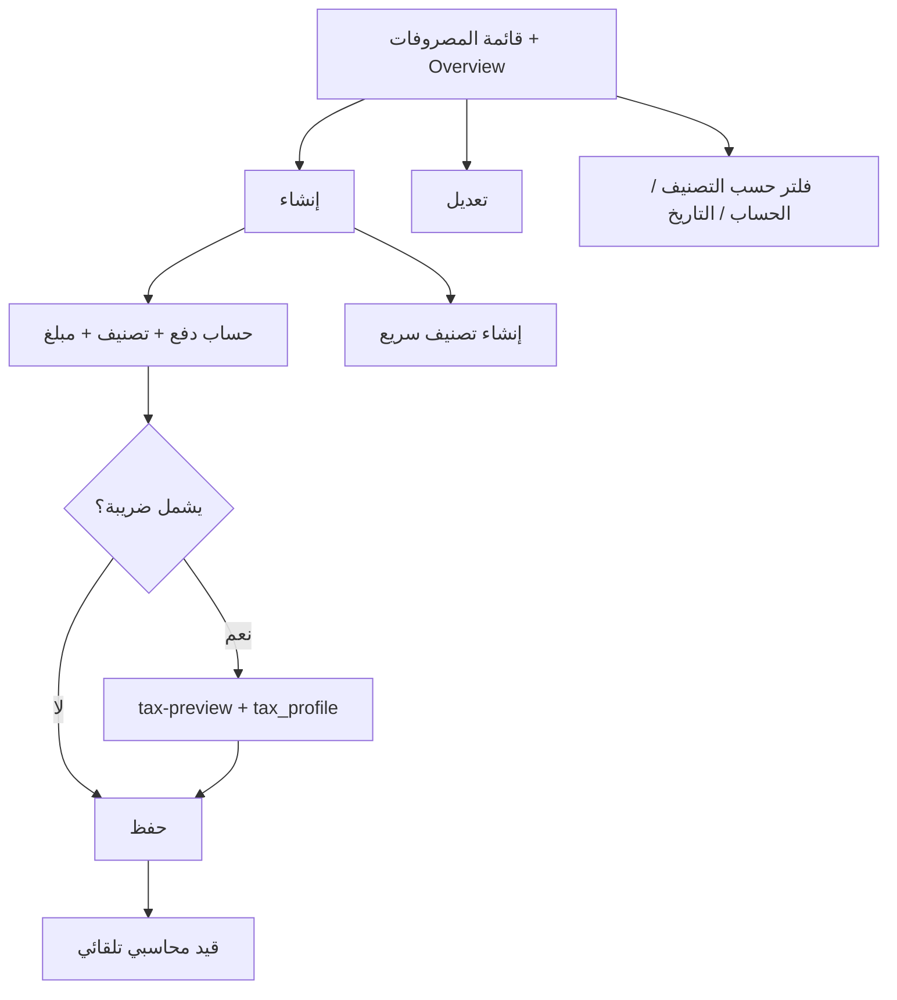

# مواصفة API المصروفات (Expenses)

> **الغرض:** مرجع حصرّي لشاشة **المصروفات** وتصنيفاتها — مواءمة الموبايل مع الويب 100%، ولـ Cursor.  
> **الحالة:** ✅ منفّذ على Laravel.  
> **مرجع عام:** [`docs/mobile-api-parity-spec.md`](mobile-api-parity-spec.md)

**مهم:** بادئة المصروفات هي `/api/v1/tenant/expenses/` (ليست تحت `shop`).  
قائمة المصروفات: `GET /expenses/expenses` — التصنيفات: `GET /expenses/categories`.

---

## 1) مرجع الويب (مصدر الحقيقة)

| الملف | الدور |
|-------|--------|
| `app/Filament/Tenant/Resources/ExpenseResource.php` | قائمة، فورم، فلاتر، قيد محاسبي |
| `.../Pages/ListExpenses.php` | إنشاء/تعديل slide-over + tabs حسب التصنيف + overview |
| `.../Widgets/ExpensesOverview.php` | بطاقات إجمالي لكل تصنيف |
| `ExpenseCategoryResource` | CRUD تصنيفات + حذف فقط إن فارغ |
| `ExpenseService` | مصدر API + قيد الإنشاء (مشترك مع الويب) |

---

## 2) الفرق: API القديم vs الويب + API الحالي

| الموضوع | API القديم | الويب + API الحالي |
|---------|------------|---------------------|
| قيد المصروف عند الإنشاء | ❌ ناقص / ضريبة فقط وبشكل خاطئ | **قيد كامل** مثل `postExpenseCreated` |
| ضريبة ضمن المبلغ | جزئي | `amount_includes_tax` + `tax_profile_id` + preview |
| مرفقات | ❌ | `attachments[]` على create/update |
| فلاتر القائمة | ضعيفة | حساب / تصنيف متعدد / تاريخ / مرفقات / search |
| مجاميع القائمة | ❌ | `filters.listSummaries` (subTotal, tax, total) |
| Overview widget | stats جزئي | `GET expenses/overview` |
| تعديل | وصف/تاريخ/تصنيف | نفس الشيء + مرفقات — **المبلغ/الضريبة/الحساب مقفولة** |
| حذف مصروف | 403 | ❌ لا حذف (مثل الويب) |
| حد الاشتراك | ❌ | `subscription_resource_maxed_out('expenses')` |

---

## 3) Headers و Base

```
Authorization: Bearer {token}
Tenant-Id: {tenant_id}
Accept: application/json
```

**Base:** `/api/v1/tenant/expenses/`

**Envelope:** `{ statusCode, statusText, message, data, errors, locale, filters? }`

**Body:** snake_case. **JSON:** camelCase.

**تواريخ:** `Y-m-d` (مفضّل؛ يُقبل `d-m-Y` ويُحوَّل).

---

## 4) المسارات

### مصروفات

| Method | Path | الوصف |
|--------|------|--------|
| GET | `expenses/expenses` | قائمة + فلاتر + summaries |
| POST | `expenses/expenses` | إنشاء + محاسبة |
| GET | `expenses/expenses/{id}` | تفاصيل |
| PUT/PATCH | `expenses/expenses/{id}` | تعديل حقول مسموحة فقط |
| DELETE | `expenses/expenses/{id}` | دائماً 403 |
| GET | `expenses/overview` | بطاقات Overview (مثل الويب) |
| GET | `expenses/prefill` | افتراضيات الفورم |
| POST | `expenses/utils/tax-preview` | معاينة الضريبة live |
| GET | `expenses/stats` | stats قديم (متوافق) |
| GET | `expenses/acc4-treasury-accounts` | حسابات الدفع = `collectionAccountOptions()` |

### تصنيفات

| Method | Path | الوصف |
|--------|------|--------|
| GET | `expenses/categories` | قائمة |
| POST | `expenses/categories` | إنشاء سريع من الفورم |
| GET | `expenses/categories/{id}` | تفاصيل + مصروفات |
| PATCH | `expenses/categories/{id}` | تعديل الاسم |
| DELETE | `expenses/categories/{id}` | فقط إن `expensesCount === 0` |

---

## 5) قائمة `GET expenses/expenses`

**Query:**

| Param | ملاحظات |
|-------|---------|
| `search` | وصف / اسم الحساب / التصنيف |
| `credit_acc4_code` أو `credit_acc4_codes[]` | حساب الدفع |
| `expense_category_id` أو `expense_category_ids[]` | تصنيف |
| `date_from` / `date_until` | على حقل `date` |
| `from_date` / `to_date` | legacy `d-m-Y` |
| `min_amount` / `max_amount` | |
| `attachments` | `true` = فقط بمرفقات |
| `include_summaries` | افتراضي `true` |
| `paginate` | |
| `sort` | `latest` \| `oldest` |

**`filters.listSummaries`:** `{ subTotal, tax, total, currency, count }`

**عنصر القائمة:**

```json
{
  "id": 1,
  "expenseCategoryId": 3,
  "expenseCategoryName": "إيجار",
  "description": "إيجار شهر 8",
  "amount": "1000.00",
  "amountNumeric": 1000,
  "amountIncludesTax": true,
  "tax": "150.00",
  "taxPercent": 15,
  "total": "1150.00",
  "totalNumeric": 1150,
  "creditAcc4Code": "120100001",
  "creditAccount": { "code": "120100001", "name": "الخزينة" },
  "date": "23-08-2026",
  "dateFormatted": "2026-08-23",
  "attachments": ["https://..."],
  "mediaCount": 1,
  "actions": { "canEdit": true, "canDelete": false }
}
```

> **ملاحظة المبالغ:** `amount` = الصافي (بدون ضريبة). `total` / `grossAmount` = شامل الضريبة. هذا يطابق accessor الويب.

---

## 6) إنشاء `POST expenses/expenses`

### بدون ضريبة

```json
{
  "date": "2026-08-23",
  "expense_category_id": 3,
  "credit_acc4_code": "120100001",
  "amount": 500,
  "amount_includes_tax": false,
  "description": "مستلزمات مكتبية"
}
```

### مع ضريبة (المبلغ شامل الضريبة — مثل الويب)

```json
{
  "date": "2026-08-23",
  "expense_category_id": 3,
  "credit_acc4_code": "120100001",
  "amount": 1150,
  "amount_includes_tax": true,
  "tax_profile_id": 1,
  "description": "إيجار شامل ضريبة"
}
```

**مرفقات:** `multipart/form-data` — `attachments[]` (png/jpg/webp/pdf، max 2048KB).

**محاسبة (مطابقة الويب):**
1. Credit `credit_acc4_code` ← Debit `122300001` بمبلغ `total`
2. إن `tax > 0`: Credit `122800001` ← Debit `122300001` بمبلغ `tax`

**حد الاشتراك:** إن وصل `max_allowed_expenses` → `422`.

---

## 7) معاينة الضريبة

```http
POST /api/v1/tenant/expenses/utils/tax-preview
```

```json
{
  "amount": 1150,
  "amount_includes_tax": true,
  "tax_profile_id": 1
}
```

**Response:** `{ amount, amountWithoutTax, tax, total, taxPercent, taxProfile }`

---

## 8) Prefill و Overview

```http
GET /api/v1/tenant/expenses/prefill
```

→ `creditAcc4Code` (افتراضي التحصيل)، `debitAcc4Code`, `date`, `amountIncludesTax: false`

```http
GET /api/v1/tenant/expenses/overview
```

→ `cards[]` لكل تصنيف مستخدم + بطاقة إجمالي (`isGrandTotal`).

---

## 9) تعديل `PATCH expenses/expenses/{id}`

مسموح فقط (مثل الويب بعد القفل):

| الحقل | |
|-------|--|
| `description` | ✅ |
| `date` | ✅ |
| `expense_category_id` | ✅ |
| `attachments[]` | ✅ إضافة |
| `amount` / `tax` / `credit_acc4_code` | ❌ مقفول |

---

## 10) تصنيفات المصروفات

```json
POST /expenses/categories
{ "name": "رواتب" }
```

`canDelete` / `actions.canDelete` = true فقط إذا لا مصروفات مرتبطة.

Query اختياري: `?include_expenses=false` لإخفاء مصفوفة `expenses` في القائمة (العدّ والإجمالي يبقيان).

---

## 11) شاشات الموبايل (إلزامي)



### Cursor prompt

```
Implement Expenses mobile screens matching docs/expenses-api-spec.md:

1. Base path: /api/v1/tenant/expenses/ (NOT shop)
2. List: GET expenses/expenses with search, category tabs, filters.listSummaries footer
3. Overview cards: GET expenses/overview
4. Create: credit_acc4_code from GET acc4-treasury-accounts, category from categories (+ quick POST), amount, optional amount_includes_tax + tax_profile_id via tax-preview, description, attachments
5. Edit: only description/date/category/attachments — lock amount/tax/account
6. No delete expense. Category delete only when canDelete=true
7. snake_case requests, camelCase responses, dates Y-m-d
```

---

**آخر تحديث:** 2026-08-23
