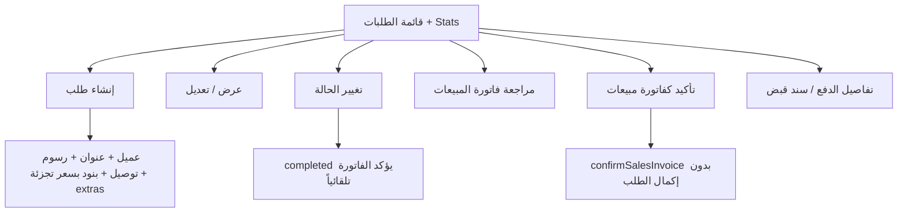

# مواصفة API الطلبات (Store Orders)

> **الغرض:** مرجع حصرّي لشاشة **طلبات المتجر** — مواءمة التطبيق مع الويب **بكل إجراءات الصف والفورم**، ولـ Cursor.  
> **الحالة:** ✅ منفّذ على Laravel.  
> **العملاء (إنشاء سريع + تبويب الطلبات):** [`docs/customers-api-spec.md`](customers-api-spec.md)  
> **فاتورة المبيعات المرتبطة (مراجعة/تعديل):** [`docs/sales-api-spec.md`](sales-api-spec.md)  
> **سند القبض (إكمال الدفع):** `receipt-vouchers`  
> **مرجع عام:** [`docs/mobile-api-parity-spec.md`](mobile-api-parity-spec.md)

**مهم:** مسار الـ API هو `orders` تحت `/api/v1/tenant/shop/`.  
لا تخلط مع `supply-orders` (أوامر التوريد للموردين) ولا مع `sales` (فواتير المبيعات المؤكدة).

**إنشاء طلب من المتجر الإلكتروني (عميل):** `POST /api/v1/store/checkout` — خارج نطاق شاشة التاجر.

---

## 1) مرجع الويب (مصدر الحقيقة)

| الملف | الدور |
|-------|--------|
| `app/Filament/Tenant/Resources/OrderResource.php` | قائمة، فورم، فلاتر، إحصائيات |
| `.../Pages/CreateOrder.php` | إنشاء + فاتورة `sale_order` + بنود |
| `.../Pages/EditOrder.php` | تعديل حتى غير مكتمل/ملغى + مزامنة الفاتورة |
| `InteractsWithOrderActions.php` | إجراءات الصف: عرض، تغيير حالة، مراجعة فاتورة، تأكيد فاتورة، الدفع |
| `OrderStats.php` | بطاقات إحصائية أعلى القائمة |
| `OrderStatusService.php` | انتقالات الحالة + تأكيد الفاتورة + رسوم التوصيل |
| `OrderService.php` | CRUD tenant (إنشاء/تعديل) — **مصدر API** |

---

## 2) الفرق: API القديم vs الويب + API الحالي

| الموضوع | API القديم | الويب + API الحالي |
|---------|------------|---------------------|
| قائمة | فلاتر محدودة، بدون pagination/search | `search`, `statuses[]`, `customer_ids[]`, `paginate`, `sort` |
| إنشاء من لوحة التاجر | `POST orders` غير منفّذ | **`POST orders`** — عميل + عنوان + توصيل + بنود + فاتورة آلية |
| تعديل الطلب | ❌ | **`PUT orders/{id}`** — رأس + استبدال البنود |
| تغيير الحالة | `PATCH orders/{id}` | نفس المسار — **`OrderStatusService`** |
| تأكيد كفاتورة مبيعات | ❌ | **`POST orders/{id}/confirm-invoice`** |
| مراجعة الفاتورة | ❌ | `actions.canReviewInvoice` → `GET/PATCH sales/{invoiceId}` |
| إكمال الدفع | `GET payments` معطوب | **`GET orders/{id}/payments`** + `receipt-vouchers` |
| مشاركة / PDF | ❌ | عبر الفاتورة: `shareUrl`, `pdfUrl` (بعد التأكيد/UID) |
| إحصائيات | ❌ | **`GET orders/stats`** |
| `actions` على كل صف | ❌ | `canChangeStatus`, `canReviewInvoice`, `canConfirmInvoice`, `canCompletePayment`, `canEdit`, `canShare` |
| حد الاشتراك / المتجر | checkout فقط | `400` على `POST orders` إذا `orders` ممتلئ أو الباقة بدون متجر |

---

## 3) Headers و Base

```
Authorization: Bearer {token}
Tenant-Id: {tenant_id}
Accept: application/json
```

**Base:** `/api/v1/tenant/shop/`  
**Body:** snake_case. **JSON:** camelCase.

**تواريخ الفلاتر:** `Y-m-d` (يُقبل أيضاً `d-m-Y` legacy).  
**تغيير الحالة:** `delivery_date` / `canceled_date` — `Y-m-d` أو `d-m-Y`.

---

## 4) شاشات الويب → التطبيق



### 4.1 إجراءات صف القائمة (إلزامي)

| إجراء الويب | `actions` | الموبايل |
|-------------|-----------|----------|
| عرض | — | `GET orders/{id}` |
| تغيير الحالة | `canChangeStatus` | `PATCH orders/{id}` |
| مراجعة كفاتورة مبيعات | `canReviewInvoice` | افتح `sales/{invoiceId}` للتعديل |
| تأكيد كفاتورة مبيعات | `canConfirmInvoice` | `POST orders/{id}/confirm-invoice` |
| تفاصيل الدفع | `canCompletePayment` | `GET orders/{id}/payments` ثم إنشاء/تعديل `receipt-vouchers` |
| تعديل الطلب | `canEdit` | `PUT orders/{id}` |
| حذف | سياسة Filament | `DELETE orders/{id}` (موجود في API، غير ظاهر في الويب) |

**قفل التعديل:** `completed` أو `cancelled` → `canEdit: false`, `PUT` → `422`.

**تأكيد عند `completed`:** تغيير الحالة إلى `completed` يستدعي `confirmSalesInvoice()` إذا الفاتورة غير مقفولة (مثل الويب).

### 4.2 فورم الإنشاء/التعديل

| حقل | ملاحظات |
|-----|---------|
| `customer_id` | مطلوب؛ إنشاء سريع عبر `POST clients` |
| `delivery_address` | مطلوب |
| `delivery` | رسوم التوصيل ≥ 0 |
| `details[]` | منتج + qty + extras؛ variant → `product_variant_id` |
| `state_id`, `city_id`, `area_id` | اختياري |
| `notes` | اختياري |

**منتجات الفورم:**  
`POST list-products-for-advanced-creation` مع `{ "for": "sales" }` (أسعار تجزئة + variants + extras).

- `type=basic`: `product_id` + `qty`
- `type=variants`: `product_variant_id` = `variants[].id`
- `product_extras_ids[]`: IDs من `selectExtras`

---

## 5) Endpoints

| Method | Path | الوصف |
|--------|------|--------|
| `GET` | `orders/stats` | إحصائيات القائمة (مثل `OrderStats`) |
| `GET` | `orders` | قائمة |
| `POST` | `orders` | إنشاء (لوحة التاجر) |
| `GET` | `orders/{id}` | تفاصيل |
| `PUT` | `orders/{id}` | تعديل كامل (رأس + بنود) |
| `PATCH` | `orders/{id}` | **تغيير الحالة فقط** |
| `DELETE` | `orders/{id}` | حذف |
| `POST` | `orders/{id}/confirm-invoice` | تأكيد الفاتورة المرتبطة |
| `GET` | `orders/{id}/payments` | معلومات الدفع + سند القبض |
| `GET` | `clients/{id}/orders` | قائمة مختصرة من تبويب العميل |

---

## 6) أمثلة

### قائمة

```
GET /api/v1/tenant/shop/orders?search=1045&statuses[]=new&statuses[]=packaging&paginate=1&per_page=20&sort=latest&from_date=2026-01-01
```

### إنشاء

```json
POST /api/v1/tenant/shop/orders
{
  "customer_id": 12,
  "delivery_address": "الخرطوم - شارع …",
  "delivery": 5000,
  "details": [
    {
      "product_id": 3,
      "product_variant_id": 44,
      "qty": 2,
      "product_extras_ids": [7]
    }
  ]
}
```

- `400` إذا الباقة بدون متجر: `store_not_available_on_plan`
- `400` إذا حد `orders`: رسالة `orders_maxed_out_*`

### تغيير الحالة

```json
PATCH /api/v1/tenant/shop/orders/{id}
{
  "status": "completed",
  "delivery_date": "2026-08-23",
  "delivery": 5000
}
```

```json
PATCH /api/v1/tenant/shop/orders/{id}
{
  "status": "cancelled",
  "canceled_date": "2026-08-23",
  "canceled_reason": "العميل ألغى"
}
```

### تأكيد الفاتورة

```
POST /api/v1/tenant/shop/orders/{id}/confirm-invoice
```

### تعديل

```json
PUT /api/v1/tenant/shop/orders/{id}
{
  "delivery": 6000,
  "details": [ ... ]
}
```

---

## 7) شكل الرد (`OrderResource`)

حقول أساسية: `id`, `no`, `status`, `statusName`, `source`, `customer`, `details[]`, `invoiceId`, `invoiceNo`, `paymentStatus`, `isPaid`, `deliveryAddress`, `deliveryType`, `total` / `totalAmount`, `actions`, `shareUrl`, `pdfUrl`, `invoiceReceiptVoucherId`.

```json
"actions": {
  "canChangeStatus": true,
  "canReviewInvoice": true,
  "canConfirmInvoice": true,
  "canCompletePayment": true,
  "canEdit": true,
  "canShare": false
}
```

`GET orders/{id}/payments`:

```json
{
  "orderId": 1,
  "invoiceId": 50,
  "isPaid": false,
  "paymentStatus": "دفع بالآجل",
  "receiptVoucherId": null,
  "canCompletePayment": true,
  "receiptVoucher": null
}
```

---

## 8) Stats

```
GET /api/v1/tenant/shop/orders/stats
```

```json
{
  "all": 120,
  "new": 5,
  "packaging": 3,
  "deliveryInProgress": 2,
  "completed": 100,
  "cancelled": 10,
  "revenue": 1500000.5,
  "currency": "SDG"
}
```

---

## 9) Cursor — Flutter (ترقية شاشة الطلبات)

```
Upgrade the existing Orders module to full web parity. Single source of truth: docs/orders-api-spec.md. Also read docs/customers-api-spec.md (customer picker) and docs/sales-api-spec.md (review linked invoice).

Web: Filament OrderResource — list with stats widget, filters (status multi, customer, date), create/edit (customer, delivery address, delivery fee, product lines with retail prices + extras), row actions: view, change status, review sales invoice, confirm sales invoice, complete payment.

API base: /api/v1/tenant/shop/

A) List
- GET orders/stats for dashboard cards on top
- GET orders with search, statuses[], customer_ids[], from_date/to_date, paginate, sort
- Row menu from data.actions — hide nothing that web shows

B) Create
- POST orders after product picker (list-products-for-advanced-creation for: sales)
- Handle subscription/store plan 400 errors

C) Detail / Edit
- GET orders/{id}
- PUT orders/{id} when actions.canEdit (replace header + details)
- PATCH orders/{id} ONLY for status modal (delivery_date, canceled_date, canceled_reason, delivery when in-progress/completed)

D) Row actions
- canReviewInvoice → navigate to sales invoice edit (invoiceId)
- canConfirmInvoice → POST orders/{id}/confirm-invoice
- canCompletePayment → GET orders/{id}/payments then receipt-vouchers create/edit with invoice_id + order_id
- shareUrl/pdfUrl when actions.canShare

E) Customer tab
- Keep GET clients/{id}/orders compact list; full detail via GET orders/{id}

Do not use store/checkout for merchant dashboard create. Match web labels and status flow exactly.
```

---

**آخر تحديث:** 2026-08-23
