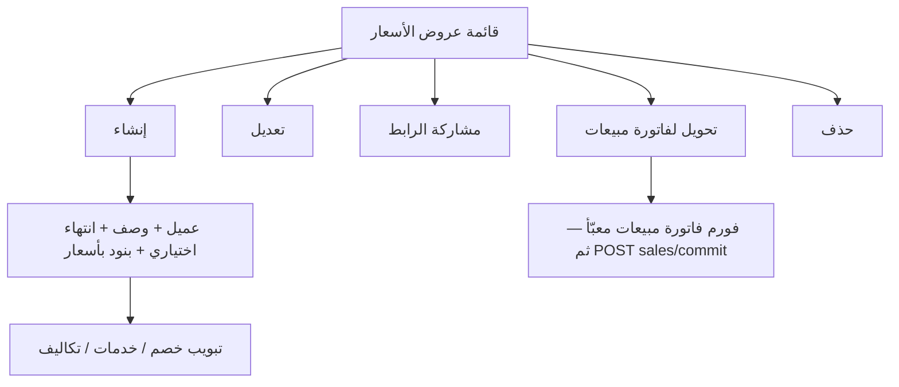

# مواصفة API عروض الأسعار (Price Offers)

> **الغرض:** مرجع حصرّي لشاشة عروض الأسعار — الوحدة **غير موجودة** في التطبيق حالياً؛ ابنِها من الصفر لتطابق الويب.  
> **الحالة:** ✅ منفّذ على Laravel.  
> **العملاء (إنشاء سريع من الفورم):** [`docs/customers-api-spec.md`](customers-api-spec.md)  
> **التحويل لفاتورة مبيعات:** [`docs/sales-api-spec.md`](sales-api-spec.md)  
> **مرجع عام:** [`docs/mobile-api-parity-spec.md`](mobile-api-parity-spec.md)

**مهم:** مسار الـ API هو `price-offers` تحت `/api/v1/tenant/shop/`.  
الرابط العام للمتجر `GET /api/v1/store/price-offers/{no}` يبقى كما هو (عرض للعميل) — لا تستخدمه داخل شاشة التاجر.

---

## 1) مرجع الويب (مصدر الحقيقة)

| الملف | الدور |
|-------|--------|
| `app/Filament/Tenant/Resources/PriceOfferResource.php` | قائمة، فورم، فلاتر، **إجراءات الصف** |
| `.../Pages/CreatePriceOffer.php` | رأس ثم بنود بعد الإنشاء + حد الاشتراك `price_offers` |
| `.../Pages/EditPriceOffer.php` | استبدال كل البنود بعد الحفظ — **بدون قفل** |
| `.../Pages/ListPriceOffers.php` | إنشاء معطّل عند حد الخطة |
| `InvoiceDocumentFormLayout` | تبويبات خصم / خدمات / تكاليف إضافية (**بدون تبويب دفعات**) |

عرض السعر **ليس فاتورة**: لا مخزون، لا قيود محاسبية، لا `payment_terms`، لا سند قبض.  
يبقى **قابلاً للتعديل والحذف** بعد الحفظ إلى أن يُحذف.

---

## 2) الفرق: قبل / بعد

| الموضوع | API / التطبيق قبل | الويب + API الحالي |
|---------|-------------------|---------------------|
| شاشة الموبايل | ❌ غير موجودة | وحدة كاملة: قائمة + إنشاء/تعديل + مشاركة + تحويل لمبيعات + حذف |
| CRUD tenant | ❌ (رابط عام للمتجر فقط) | `GET/POST/PATCH/DELETE shop/price-offers` |
| بنود بأسعار | الاسم والسعر في الرابط العام | `productId`, `productVariantId`, `qty`, `unitPrice`, extras, ضريبة |
| انتهاء الصلاحية | `expired` في الرابط العام | فلتر `expiration` + شارة + تعطيل التحويل |
| مشاركة | ❌ داخل التطبيق | `shareUrl` (نفس صفحة الويب العامة) |
| تحويل لفاتورة مبيعات | من قائمة المبيعات فقط | نفس `sales-prefill` من صف العرض **أو** من قائمة المبيعات |
| خدمات / تكاليف | في الرابط العام | داخل `POST/PATCH` كمصفوفات |
| حد الاشتراك | ❌ | نفس `price_offers` في الويب |

لا مسار temp. إنشاء واحد: `POST price-offers`.

---

## 3) Headers و Base

```
Authorization: Bearer {token}
Tenant-Id: {tenant_id}
Accept: application/json
```

**Base:** `/api/v1/tenant/shop/`  
**Body الطلب:** snake_case  
**JSON الرد:** camelCase  
**تواريخ الفلاتر و`expires_at` في الطلب:** `Y-m-d` (يُقبل أيضاً `d-m-Y` و `d/m/Y`)  
حقل `date` / `expiresAt` في الرد بقي `d-m-Y` للتوافق مع الرابط العام. استخدم `expiresOn` (`Y-m-d`) لربط DatePicker.

المغلف:

```json
{ "statusCode": 200, "statusText": "success", "message": "...", "data": {}, "errors": [], "locale": "ar" }
```

---

## 4) شاشات الويب → شاشات التطبيق



### القائمة (مثل الويب)

أعمدة: الرقم المرجعي، الوصف، العميل، تاريخ الانتهاء، شارة الحالة (`active` / `expired`)، تاريخ الإنشاء.

بحث: الرقم + الوصف + اسم العميل.

فلاتر: `customer_id`، `from_date` / `to_date` (تاريخ الإنشاء)، `expiration=active|expired`.

إجراءات الصف (من `data.actions` — لا تخترع إظهاراً):

| الإجراء | الشرط | ماذا تفعل |
|---------|--------|-----------|
| مشاركة | `canShare` دائماً true | انسخ/افتح `shareUrl` |
| تحويل لفاتورة مبيعات | `canConvertToSalesInvoice` | `GET .../sales-prefill` ثم شاشة المبيعات. **معطّل إذا منتهٍ** |
| تعديل | `canEdit` دائماً true | `GET` ثم `PATCH` |
| حذف | `canDelete` دائماً true | `DELETE` بعد تأكيد |

Header: زر إنشاء — إذا رجع `400` حد الاشتراك اعرض الرسالة كما هي.

### فورم الإنشاء / التعديل (مثل الويب)

1. **رقم مرجعي** — السيرفر يولّده (`HasPrefixedId`). لا ترسل `no`. للعرض فقط بعد الحفظ.
2. **عميل** إلزامي — بحث `GET /clients?search=` + إنشاء سريع `POST /clients` بالاسم ثم استخدم الـ id. انظر مواصفة العملاء.
3. **وصف** إلزامي.
4. **تاريخ الانتهاء** اختياري (`expires_at`). إن وُضع وكان اليوم أو قبله → العرض **منتهٍ** ولا يمكن تحويله.
5. **بنود** (min 1): منتج + extras اختيارية + كمية 1–250000 + **سعر** + خصم بند + ملف ضريبي.
6. **تبويبات:** خصم إجمالي (اختياري) + خدمات + تكاليف إضافية. **لا تبويب دفعات ولا نقد/آجل.**
7. `prices_includes_taxes` افتراضي `true` (نفس الويب).

منتجات الفورم:

```
POST /api/v1/tenant/shop/list-products-for-advanced-creation
{ "for": "price_offers" }
```

نفس شكل مبيعات: `suggestedPrice`، `variants[].id` + `variants[].suggestedPrice`، `selectExtras[].id` + `price`.

- `type=basic`: أرسل `product_id` والسعر الافتراضي `suggestedPrice`.
- `type=variants`: اختر من `variants[]` وأرسل `product_variant_id` = `variants[].id`. **لا** تركّب من `selectVariantOptions`.
- extras: مصفوفة IDs في `details[].extras`.

أنواع مساعدة:

| الغرض | Endpoint |
|--------|----------|
| خدمات | `GET /api/v1/tenant/settings/services-types` |
| تكاليف إضافية | `GET /api/v1/tenant/settings/additional-costs-types` |
| ضرائب | `GET /api/v1/tenant/settings/tax-profiles` |

---

## 5) Endpoints

| Method | Path | الوصف |
|--------|------|--------|
| `GET` | `price-offers` | قائمة |
| `POST` | `price-offers` | إنشاء |
| `GET` | `price-offers/{id}` | تفاصيل كاملة |
| `PUT`/`PATCH` | `price-offers/{id}` | تعديل (استبدال البنود/الخدمات/التكاليف إذا أُرسلت) |
| `DELETE` | `price-offers/{id}` | حذف (extras → بنود → خدمات/تكاليف → العرض) |
| `GET` | `price-offers/{id}/sales-prefill` | JSON لفورم المبيعات — **لا ينشئ فاتورة** |
| `GET` | `price-offers-for-sales` | قائمة غير منتهية فقط (إجراء قائمة **المبيعات**) |

الرابط العام (ليس شاشة التاجر): `GET /api/v1/store/price-offers/{no}`.

---

## 6) GET — القائمة

```
GET /api/v1/tenant/shop/price-offers
```

**Query:**

| المعامل | القيم |
|---------|--------|
| `search` | رقم / وصف / اسم عميل |
| `customer_id` | integer |
| `expiration` | `active` \| `expired` |
| `from_date` / `to_date` | `Y-m-d` (تاريخ `created_at`) |
| `sort` | `latest` (افتراضي) \| `oldest` |
| `paginate` | truthy لتفعيل الصفحات |
| `per_page` | 1–100 |

`products` / المجاميع **غير مضمّنة** في القائمة (تُحمَّل في show).

```json
{
  "id": 12,
  "no": "18492033",
  "customerId": 4,
  "description": "عرض رمضان",
  "date": "17-08-2026",
  "createdAt": "2026-08-17 10:00:00",
  "updatedAt": "2026-08-17 10:00:00",
  "expiresAt": "01-09-2026",
  "expiresOn": "2026-09-01",
  "expired": false,
  "expirationStatus": "active",
  "expiredMessage": null,
  "shareUrl": "https://client.example.com/{slug}/price-offers/18492033",
  "pricesIncludesTaxes": true,
  "detailsCount": 3,
  "customer": { "id": 4, "name": "أحمد" },
  "actions": {
    "canShare": true,
    "canConvertToSalesInvoice": true,
    "canEdit": true,
    "canDelete": true
  }
}
```

`expirationStatus`: `active` \| `expired` — لشارة القائمة (أخضر / أحمر مثل الويب).

عرض منتهٍ: `expired: true`، `canConvertToSalesInvoice: false`. اعرض تلميحاً `fields.price_offer_expired_cannot_convert` على زر التحويل.

---

## 7) POST — إنشاء

```
POST /api/v1/tenant/shop/price-offers
```

```json
{
  "customer_id": 4,
  "description": "عرض رمضان",
  "expires_at": "2026-09-01",
  "prices_includes_taxes": true,
  "notes": null,
  "discount_option": "per-item",
  "discount_method": "amount",
  "details": [
    {
      "product_id": 12,
      "product_variant_id": null,
      "qty": 10,
      "price": 80.00,
      "discount": 5,
      "tax_profile_id": 1,
      "extras": [3, 8]
    },
    {
      "product_id": 15,
      "product_variant_id": 44,
      "qty": 2,
      "price": 120.50,
      "discount": 0,
      "tax_profile_id": null
    }
  ],
  "services": [
    {
      "service_type_id": 1,
      "price": 25,
      "description": "تركيب",
      "tax_profile_id": null
    }
  ],
  "additional_costs": [
    {
      "additional_cost_type_id": 1,
      "cost": 15,
      "statement": "توصيل",
      "tax_profile_id": null
    }
  ]
}
```

قواعد:

- `customer_id` + `description` + `details` (min 1) إلزامية.
- `expires_at` اختياري. أرسل `null` أو احذف الحقل = بلا انتهاء.
- `details.*.price` ≥ 0.01. الكمية 1–250000.
- `details.*.extras` = IDs من `selectExtras` لنفس المنتج. extra لا يتبع المنتج → `422`.
- منتج `variants` بدون `product_variant_id` → `422`.
- يُقبل الاسم البديل `items` بدل `details` (يُحوَّل في السيرفر). فضّل `details`.
- يُقبل `product_extras_ids` كاسم بديل لـ `extras`.
- `no` و `user_id` و `tenant_id` من السيرفر.
- خصم البند **يُحفظ** (لا تُصفَّر كما في باج إنشاء الويب القديم).
- حد الاشتراك: `400` برسالة `price_offers_maxed_out_*`.
- نجاح: `201` + جسم التفاصيل (مثل show) بما فيه `products` والمجاميع.

خصم إجمالي اختياري (تبويب الويب):

- `discount_option`: `none` \| `per-item` \| `overall`
- `discount_method`: `none` \| `amount` \| `percent`
- `discount_amount` / `discount_percent`

إذا لم تُرسل ووُجد خصم على بند، السيرفر يضع `per-item` / `amount`.

---

## 8) GET — تفاصيل

```
GET /api/v1/tenant/shop/price-offers/{id}
```

نفس حقول القائمة + `products` + `services` + `additionalCosts` + المجاميع (`total`, `discount`, `tax`, `totalWithTax`).

بند داخل `products`:

```json
{
  "id": 9,
  "name": "عسل سدر",
  "productId": 12,
  "productVariantId": null,
  "itemType": "basic",
  "unitPrice": "80.00",
  "qty": 10,
  "discount": "5.00",
  "tax": "0.00",
  "taxProfileId": 1,
  "extras": [
    { "id": 1, "productExtraId": 3, "name": "تعبئة خاصة", "price": "2.00" }
  ],
  "extrasTotal": "20.00",
  "subTotal": "797.00"
}
```

`itemType`: `basic` \| `variants`.  
المجاميع في الرأس تستخدم فواصل الآلاف (`.` عشري، `,` آلاف) كما في الرابط العام — لا تكسر هذا الشكل.

لتعبئة فورم التعديل: `unitPrice` → `price`، `extras[].productExtraId` → `extras`، `expiresOn` → DatePicker.

---

## 9) PATCH — تعديل

```
PATCH /api/v1/tenant/shop/price-offers/{id}
```

نفس حقول الإنشاء وكلها `sometimes`. العرض **غير مقفول**.

- إذا أُرسل `details` يُحذف القديم (مع extras) ويُحفظ الجديد — مثل Edit في الويب.
- إذا أُرسل `services` تُستبدل كلها.
- إذا أُرسل `additional_costs` تُستبدل كلها.
- `expires_at: null` يزيل تاريخ الانتهاء.
- تعديل وصف فقط بدون `details` لا يمس البنود.

---

## 10) DELETE

يحذف extras البنود ثم البنود ثم الخدمات والتكاليف ثم العرض. `200`.

لا قيود محاسبية تمنع الحذف (عكس الفواتير المؤكدة).

---

## 11) تحويل لفاتورة مبيعات

**مثل الويب:** التحويل يفتح فورم فاتورة مبيعات معبّأ؛ المستخدم يقدر يعدّل ثم يؤكد. **لا تُنشأ فاتورة هنا.**

من صف العرض (`canConvertToSalesInvoice === true`):

```
GET /api/v1/tenant/shop/price-offers/{id}/sales-prefill
```

من قائمة **المبيعات** (إجراء مستقل): أولاً اختر عرض غير منتهٍ:

```
GET /api/v1/tenant/shop/price-offers-for-sales
```

```json
{ "id": 12, "no": "18492033", "description": "عرض رمضان", "customerId": 4, "customerName": "أحمد", "expiresAt": "2026-09-01" }
```

ثم نفس `sales-prefill`.

عرض منتهٍ: `422` مع `price_offer_id` / `fields.price_offer_expired_cannot_convert`. لا تفتح الفورم.

شكل prefill (عبّئ فورم المبيعات ثم `POST sales/commit`):

```json
{
  "priceOfferId": 12,
  "priceOfferNo": "18492033",
  "description": "عرض رمضان",
  "expired": false,
  "customerId": 4,
  "customerName": "أحمد",
  "pricesIncludesTaxes": true,
  "discountOption": "per-item",
  "discountMethod": "amount",
  "items": [
    {
      "productId": 12,
      "productVariantId": null,
      "name": "عسل سدر",
      "qty": 10,
      "price": "80.00",
      "discount": "5.00",
      "taxProfileId": 1,
      "extras": [3, 8]
    }
  ],
  "services": [],
  "additionalCosts": []
}
```

بعد التعديل في فورم المبيعات أرسل `POST /sales/commit` حسب [`docs/sales-api-spec.md`](sales-api-spec.md) (`customer_id`, `items` بالأسعار، `payment_terms` افتراضي credit، …).

عرض السعر **لا يُقفل ولا يُحذف** بعد التحويل — يمكن تحويله مرة أخرى أو تعديله.

---

## 12) ما لا تفعله

- لا تستخدم مسار فواتير المبيعات temp (`POST sales` ثم add-item ثم save) لهذه الوحدة.
- لا ترسل `payment_terms` أو `credit_payment` على عرض السعر.
- لا تفترض قفل بعد الحفظ.
- لا تُظهر منتجات بلا سعر (`list-products` لـ `price_offers` يفلتر `has('lastPrice')` مثل المبيعات).
- لا تكسر الرابط العام للمتجر: الحقول الجديدة **مضافة** (`shareUrl`, `customerId`, `description`, `actions`, …).

---

## 13) Prompt جاهز لـ Cursor (Flutter)

انسخ هذا البرومبت كما هو:

```
Implement a full Price Offers module from scratch (it does not exist in the app) to match the MyBee web app. Single source of truth: docs/price-offers-api-spec.md. Also read docs/sales-api-spec.md for convert-to-invoice, and docs/customers-api-spec.md for quick-create customer.

Web: Filament PriceOfferResource — list, create/edit (customer + required description + optional expires_at + priced product lines + extras + discount tab + services + additional costs, NO payments tab), share URL, convert to sales invoice (disabled if expired), edit, delete. Offers stay editable after save. No stock / no accounting / no payment_terms.

API base: /api/v1/tenant/shop/
Auth: Bearer + Tenant-Id.
Body snake_case, response camelCase.

Must implement:

A) List GET price-offers
- Columns: no, description, customer name, expiresAt (placeholder if null), expirationStatus badge (active green / expired red), createdAt.
- Search: no / description / customer.
- Filters: customer_id, from_date/to_date Y-m-d, expiration=active|expired.
- Row actions from data.actions:
  1. Share: copy/open shareUrl.
  2. Convert to sales invoice if canConvertToSalesInvoice: GET price-offers/{id}/sales-prefill, fill sales form, POST sales/commit. If expired, disable + tooltip.
  3. Edit.
  4. Delete with confirmation.
- Header Create. On 400 show subscription limit message.

B) Create/Edit
- Server generates no — display after save only.
- customer required (GET/POST clients). description required. expires_at optional Y-m-d (bind expiresOn on edit).
- Lines: POST list-products-for-advanced-creation { "for": "price_offers" }. Show basic AND variants. Variants: pick variants[].id as product_variant_id. Default price = suggestedPrice or variants[].suggestedPrice. Optional extras[] from selectExtras. qty 1–250000. Line discount + tax_profile_id optional.
- POST body field is details[] (items[] also accepted). Each line: product_id, product_variant_id, qty, price, discount, tax_profile_id, extras.
- Tabs: overall discount optional; services (GET settings/services-types); additional costs (GET settings/additional-costs-types). NO cash/credit/payment tab.
- prices_includes_taxes default true.
- PATCH with details replaces all lines (like web edit).

C) Convert does NOT create an invoice. Prefill then POST sales/commit. Offer remains editable.

D) Do not use the public store GET /api/v1/store/price-offers/{no} inside the merchant screens except to preview shareUrl.
```

---

## 14) QA

| # | سيناريو | المتوقع |
|---|---------|---------|
| 1 | إنشاء بعميل + وصف + بند بسعر | `201` + `no` + `shareUrl` + `products` |
| 2 | بدون بنود | `422` على `details` |
| 3 | variants بدون `product_variant_id` | `422` |
| 4 | extra لا يتبع المنتج | `422` |
| 5 | حد الاشتراك | `400` رسالة الحد |
| 6 | `expires_at` اليوم أو أقدم | `expired: true`، `canConvertToSalesInvoice: false` |
| 7 | تحويل عرض منتهٍ | `422` |
| 8 | prefill ثم `sales/commit` | فاتورة بنفس العميل/البنود/الخدمات؛ العرض ما زال موجوداً |
| 9 | PATCH وصف فقط | البنود لا تُحذف |
| 10 | PATCH مع `details` | البنود تُستبدل |
| 11 | DELETE | البنود والـ extras تُحذف مع العرض |
| 12 | `shareUrl` | يفتح الصفحة العامة لنفس الرقم |
| 13 | الرابط العام للمتجر | ما زال يعمل؛ الحقول القديمة موجودة |
| 14 | قائمة المبيعات `price-offers-for-sales` | عروض غير منتهية فقط |

---

*آخر تحديث: 2026-08-17.*
