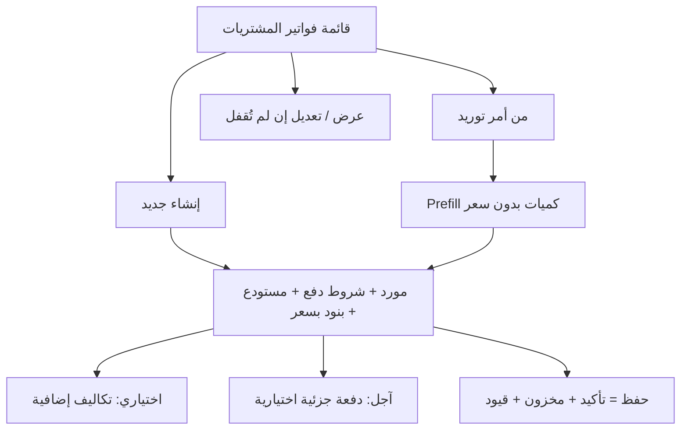

# مواصفة API فواتير المشتريات (Purchase Invoices)

> **الغرض:** مرجع حصرّي لشاشة فواتير المشتريات — مواءمة التطبيق مع الويب، ولـ Cursor.  
> **الحالة:** ✅ منفّذ على Laravel.  
> **يكمل:** [`docs/supply-orders-api-spec.md`](supply-orders-api-spec.md) (التحويل من أمر توريد).  
> **مرجع عام:** [`docs/mobile-api-parity-spec.md`](mobile-api-parity-spec.md)

---

## 1) مرجع الويب

| الملف | الدور |
|-------|--------|
| `app/Filament/Tenant/Resources/PurchaseInvoiceResource.php` | قائمة، فورم (مورد، شروط دفع، مستودع، بنود بسعر/ضريبة/خصم، تكاليف إضافية) |
| `.../Pages/CreatePurchaseInvoice.php` | إنشاء مؤكد مباشرة + `confirmPurchaseInvoice()` + دفعة آجل اختيارية |
| `.../Pages/EditPurchaseInvoice.php` | تعديل البنود فقط إذا `locked_at` فارغ |
| `Invoice::confirmPurchaseInvoice()` | قفل + مخزون + قيود محاسبية |
| `InvoicePaymentTermsService` | دفعة آجل (`recordCreditPayment`) |

**API:** `PurchaseInvoiceController` + `PurchaseInvoiceService::commit()`. لا تكرّر منطق المخزون/المحاسبة في Flutter.

---

## 2) الفرق: قبل / بعد

| الموضوع | API القديم | الويب + API الحالي |
|---------|------------|---------------------|
| إنشاء | `POST purchases` → مسودة **temp** فارغة ثم add-item ثم `save` (تبقى `purchase_order` غير مؤكدة) ثم `update-status` | **`POST purchases/commit`** فاتورة **مؤكدة** دفعة واحدة (مثل الويب) |
| `payment_terms` | ❌ | `cash` \| `credit` (الافتراضي **credit**) |
| دفعة آجل | ❌ | `credit_payment` اختياري مع الآجل |
| تفاصيل | ❌ `GET purchases/{id}` كان يفشل | `GET purchases/{id}` |
| تحويل من أمر توريد | `start-purchase-invoice` يبني temp بأسعار 0 (`update-item` يرفض `unit_cost < 1`) | `GET supply-orders/{id}/purchase-prefill` ثم `commit` بالأسعار |
| قفل بعد التأكيد | غير موثّق | `lockedAt` + `canEdit: false` — لا تعديل بعد التأكيد |

**مسار الـ temp القديم ما زال يعمل** — لا تحذفه. الشاشات الجديدة تستخدم `commit`.

---

## 3) Headers و Base

```
Authorization: Bearer {token}
Tenant-Id: {tenant_id}
Accept: application/json
```

**Base:** `/api/v1/tenant/shop/`

**Envelope:** `{ statusCode, statusText, message, data, errors, locale }`

**Body:** snake_case. **JSON:** camelCase.

**تواريخ القائمة (legacy):** `d-m-Y` ما زال مقبولاً. `Y-m-d` مقبول أيضاً ويُحوَّل داخلياً.  
**تاريخ `commit` و `credit_payment.date`:** `Y-m-d` (مثل DatePicker الويب). `d-m-Y` مقبول ويُحوَّل.

---

## 4) شاشات الويب



**فورم الإنشاء:** رقم (سيرفر)، تاريخ (آخر 30 يوماً حتى اليوم)، مورد (إنشاء سريع)، `payment_terms` افتراضي credit، مستودع (إنشاء سريع)، بنود: منتج + كمية + **سعر** + خصم + ضريبة، تبويب تكاليف إضافية، تبويب دفعات (ظاهر للآجل).

**بعد الحفظ:** الحالة `confirmed` و`locked_at` مُعبأ. النقد لا يُسجّل سند صرف تلقائياً في المشتريات (عكس المبيعات) — هذا سلوك الويب.

**منتجات الفورم:**  
`POST /api/v1/tenant/shop/list-products-for-advanced-creation` مع `{ "for": "purchases" }`.

`selectVariantOptions` بقي كما هو (مسار المبيعات/temp القديم: لون ثم مقاس).  
**للـ commit استخدم `variants[]` — كل عنصر هو تركيبة جاهزة بـ `id`:**

```json
{
  "id": 15,
  "type": "variants",
  "name": "تيشيرت",
  "taxProfileId": 3,
  "selectVariantOptions": [
    {
      "variantLibraryName": "اللون",
      "variantLibraryId": 1,
      "options": [{ "id": 10, "name": "أحمر" }, { "id": 11, "name": "أزرق" }]
    }
  ],
  "variants": [
    { "id": 44, "productId": 15, "name": "أحمر / L", "sku": "TSH-R-L", "variantLibraryOptionsIds": [10, 21] },
    { "id": 45, "productId": 15, "name": "أزرق / M", "sku": "TSH-B-M", "variantLibraryOptionsIds": [11, 22] }
  ],
  "selectExtras": []
}
```

- `type=basic`: أرسل `product_id` فقط، `variants` فارغة.
- `type=variants`: اعرض `variants` كقائمة اختيار (كل صف = `product_variant_id`). لا تحسب التركيب من `selectVariantOptions`.
- بديل: أرسل `selected_variant_options_ids: [10, 21]` بدون `product_variant_id` والسيرفر يحوّلها. المسار الأوضح للموبايل هو `variants[].id`.

**حسابات التحصيل لدفعة الآجل:**  
`GET /api/v1/tenant/settings/utils/accounts/collection`

**مستودعات:** `GET /api/v1/tenant/settings/warehouses`  
**ملفات ضريبة:** `GET /api/v1/tenant/settings/tax-profiles`  
**أنواع التكلفة الإضافية:** `GET /api/v1/tenant/settings/additional-costs-types`  
**موردون:** `GET /api/v1/tenant/shop/suppliers` — إنشاء سريع: `POST /suppliers` بالاسم.

---

## 5) Endpoints

| Method | Path | الوصف |
|--------|------|--------|
| `GET` | `purchases` | قائمة (غير temp) |
| `GET` | `purchases/{id}` | تفاصيل |
| `POST` | `purchases/commit` | **إنشاء مؤكد دفعة واحدة (المسار الجديد)** |
| `POST` | `purchases` | مسودة temp (legacy) |
| `POST` | `purchases/add-item` | legacy |
| `POST` | `purchases/update-item` | legacy — `unit_cost` min **1** |
| `POST` | `purchases/delete-item` | legacy |
| `POST` | `purchases/add-additional-cost` | legacy |
| `POST` | `purchases/update-additional-cost` | legacy |
| `POST` | `purchases/delete-additional-cost` | legacy |
| `POST` | `purchases/apply-overall-discount` | legacy |
| `POST` | `purchases/remove-overall-discount` | legacy |
| `POST` | `purchases/save` | legacy — `temp=false`، تبقى `purchase_order` |
| `POST` | `purchases/update-status` | legacy — `confirmed` يستدعي `confirmPurchaseInvoice` |
| `POST` | `purchases-clear-temp-invoices` | حذف المسودات temp |
| `GET` | `supply-orders/{id}/purchase-prefill` | JSON للـ commit بدون إنشاء فاتورة |
| `POST` | `supply-orders/{id}/start-purchase-invoice` | legacy temp بأسعار 0 |
| `GET` | `suppliers/{id}/purchase-invoices` | قائمة مختصرة من صفحة المورد |

`PUT`/`PATCH` `purchases/{id}` و `DELETE` غير مدعومين (مثل الويب بعد القفل / لا حذف في الجدول).

---

## 6) GET — القائمة

```
GET /api/v1/tenant/shop/purchases
```

**Query:**

| المعامل | ملاحظات |
|---------|---------|
| `search` | رقم الفاتورة أو اسم المورد |
| `status` | `purchase_order` \| `confirmed` \| `cancelled` |
| `payment_terms` | `cash` \| `credit` |
| `supplier_id`, `warehouse_id`, `user_id` | |
| `from_date`, `to_date`, `date` | `d-m-Y` أو `Y-m-d` |
| `sort` | `latest` (افتراضي) \| `oldest` |
| `paginate`, `per_page` | مثل العملاء |
| `payment_status` | قيم إنجليزية قديمة: `Post paid`, `Partly paid`, `Paid` |
| `payment_method`, `transaction_ref`, `discount_method` | legacy |

القائمة لا تتضمّن `temp=true`.

---

## 7) POST — commit (المسار المعتمد)

```
POST /api/v1/tenant/shop/purchases/commit
```

```json
{
  "supplier_id": 7,
  "warehouse_id": 1,
  "date": "2026-08-16",
  "payment_terms": "credit",
  "prices_includes_taxes": true,
  "notes": null,
  "items": [
    {
      "product_id": 12,
      "product_variant_id": null,
      "qty": 10,
      "unit_cost": 25.5,
      "discount": 0,
      "tax_profile_id": 3
    },
    {
      "product_id": 15,
      "product_variant_id": 44,
      "qty": 2,
      "unit_cost": 40,
      "tax_profile_id": 3
    }
  ],
  "additional_costs": [
    {
      "additional_cost_type_id": 1,
      "cost": 50,
      "statement": "شحن",
      "tax_profile_id": null
    }
  ],
  "credit_payment": {
    "account_code": "120100001",
    "amount": 100,
    "date": "2026-08-16",
    "statement": "دفعة أولى"
  }
}
```

### قواعد

- `supplier_id` و `warehouse_id` و `items` إلزامية. بند واحد على الأقل.
- `unit_cost` يمكن إرساله باسم `price`. الحد الأدنى `0.01`.
- `qty` عدد صحيح ≥ 1.
- منتج `type=variants`: **إلزامي** `product_variant_id` (من `variants[].id`) أو `selected_variant_options_ids`. بدونها `422`.
- `payment_terms` افتراضي `credit`. `cash` لا يُنشئ سند صرف تلقائي (مثل الويب).
- `credit_payment` **اختياري**، وفقط مع الآجل. `amount` ≤ المتبقي بعد التأكيد. إن فشل الدفع تُلغى الفاتورة كلها (`422`).
- `date` ضمن آخر 30 يوماً حتى اليوم.
- حد الاشتراك `purchase_invoices`: `400`.
- السيرفر يولّد `no`، يحسب الضريبة، يستدعي `confirmPurchaseInvoice()` (مخزون + قيود)، ثم الدفعة الآجلة إن وُجدت.
- `201` + نفس شكل `GET purchases/{id}`.
- `variant` يجب أن يتبع `product_id`.

**نقد (`cash`):** الفاتورة مؤكدة وقد تبقى `settlementStatusKey: due` ما لم يُسجَّل سند صرف لاحقاً.

**آجل بدون دفعة:** `due`. مع دفعة جزئية: `partial`. مع دفعة تغطي الكل: `paid`.

---

## 8) GET — تفاصيل

```
GET /api/v1/tenant/shop/purchases/{id}
```

حقول **مضافة** (القديمة باقية):

```json
{
  "id": 88,
  "no": "10459001",
  "uid": "...",
  "status": "confirmed",
  "paymentTerms": "credit",
  "settlementStatusKey": "partial",
  "settlementStatus": "...",
  "pricesIncludesTaxes": true,
  "lockedAt": "2026-08-16 15:04:00",
  "supplierId": 7,
  "warehouseId": 1,
  "canUpdateStatus": false,
  "canEdit": false,
  "hasPurchaseReturn": false,
  "purchasesReturnsCount": 0,
  "paymentVoucherId": 12,
  "items": [
    {
      "id": 1,
      "productId": 12,
      "productVariantId": null,
      "taxProfileId": 3,
      "qty": 10,
      "price": "25.50",
      "discount": "0.00",
      "tax": "...",
      "subTotal": "..."
    }
  ]
}
```

`date` / `createdAt` بقيت بصيغة `F j, Y, g:i a` للتوافق مع التطبيق القديم.

`settlementStatusKey`: `cash` \| `paid` \| `due` \| `partial`.

---

## 9) التحويل من أمر توريد

**نفّذ هذا القسم فقط عندما توجد شاشة أوامر توريد في الموبايل.** الـ endpoints جاهزة على الباك؛ لا حاجة لمسار مؤقت داخل فاتورة المشتريات.

```
GET /api/v1/tenant/shop/supply-orders/{id}/purchase-prefill
```

```json
{
  "supplyOrderId": 3,
  "supplyOrderNo": "10458291",
  "description": "توريد مواد خام",
  "supplierId": 7,
  "supplierName": "مؤسسة الإمداد",
  "items": [
    {
      "productId": 12,
      "productVariantId": null,
      "name": "سكر",
      "qty": 10,
      "unitCost": null,
      "taxProfileId": 3
    }
  ]
}
```

لا يُنشئ فاتورة. المستخدم يعبّئ `unit_cost` لكل بند ثم `POST purchases/commit` مع `supplier_id` من الرد + `warehouse_id` من الفورم + البنود بالأسعار.

الأمر بلا بنود: `400`.

### مسار temp القديم (لا تستخدمه في الشاشات الجديدة)

`POST supply-orders/{id}/start-purchase-invoice` → فاتورة temp بأسعار 0 → `update-item` (min 1) → `save` → `update-status: confirmed`.

---

## 10) مسار temp القديم (للتوافق فقط)

1. `POST purchases` → `{ no, uid }`
2. `POST purchases/add-item` `{ purchase_invoice_uid, product_id, type: basic|variants, qty, unit_cost, ... }`
3. تكاليف/خصم إجمالي اختيارياً
4. `POST purchases/save` `{ uid, no, date: d-m-Y, supplier_id, warehouse_id, payment_terms? }` — **لا تؤكّد**
5. `POST purchases/update-status` `{ purchase_invoice_uid, status: confirmed|cancelled, payment_terms?, credit_payment? }`

`save` يقبل الآن `payment_terms` و `prices_includes_taxes` اختيارياً.  
`update-status` عند `confirmed` يقبل `credit_payment` اختيارياً.

---

## 11) Prompt جاهز لـ Cursor (Flutter)

انسخ هذا البرومبت كما هو:

```
Implement Purchase Invoices screens to match the MyBee web app using docs/purchases-api-spec.md as the single source of truth.

Web: Filament PurchaseInvoiceResource — list, create confirmed invoice (supplier, payment_terms cash|credit default credit, warehouse, priced lines, optional additional costs, optional credit payment), lock after save. Convert from supply order pre-fills qty with null prices.

API base: /api/v1/tenant/shop/
Auth: Bearer + Tenant-Id.

NEW screens MUST use POST purchases/commit (one-shot confirmed). Do NOT use the temp draft flow (POST purchases + add-item + save + update-status) for new UI.

Must implement:
1) List: GET purchases. search on no/supplier name. Filters: payment_terms, supplier, dates. Show settlementStatusKey, paid/unpaid, supplier. Open GET purchases/{id}.
2) Create: supplier (search + optional POST /suppliers name only), warehouse from GET /api/v1/tenant/settings/warehouses (optional quick create), payment_terms default credit, date Y-m-d last 30 days to today, lines via POST list-products-for-advanced-creation { "for": "purchases" }. Show BOTH basic and variants products. For type=variants pick from variants[] (each has id) and send product_id + product_variant_id. Do NOT try to cartesian-product selectVariantOptions yourself. Each line: product_id, optional product_variant_id, qty, unit_cost (>=0.01), optional discount, optional tax_profile_id (default taxProfileId from the product). Optional additional_costs. If credit, optional credit_payment { account_code from GET /api/v1/tenant/settings/utils/accounts/collection, amount, date, statement }. Server computes tax, stocks, journals. Do not post cash payment yourself.
3) Convert from supply order: SKIP until the app has a Supply Orders screen. Endpoints exist (GET supply-orders/{id}/purchase-prefill then POST purchases/commit) but must not be wired from the purchases form yet.
4) Confirmed invoices are locked (lockedAt set, canEdit false). No PATCH/DELETE. Purchase return is a later screen using hasPurchaseReturn / paymentVoucherId.
5) Keep calling old temp endpoints only if existing production code already depends on them.

Body snake_case, response camelCase.
```

---

## 12) QA

| # | سيناريو | المتوقع |
|---|---------|---------|
| 1 | `POST commit` بمورد + مستودع + بند بسعر | `201`، `status=confirmed`، `lockedAt` غير فارغ، حركة مخزون |
| 2 | بدون بنود | `422` على `items` |
| 3 | `unit_cost` = 0 | `422` |
| 4 | آجل + `credit_payment.amount` أكبر من الإجمالي | `422`، لا فاتورة |
| 5 | نقد | مؤكدة، غالباً `settlementStatusKey=due` (لا سند تلقائي) |
| 6 | حد الاشتراك | `400` |
| 7 | prefill ثم commit | نفس المورد والكميات مع الأسعار المُرسلة |
| 8 | `GET purchases/{id}` بعد commit | بنود + `paymentTerms` + `supplierId` |
| 9 | مسار temp القديم `store` → add-item → save | ما زال `purchase_order` حتى `update-status` |
| 10 | variant لا يتبع المنتج | `422` على `items` |
| 11 | منتج variants بدون `product_variant_id` | `422` |
| 12 | `product_variant_id` من `variants[].id` | بند بالاسم المركّب (مثلاً أحمر / L) |

---

*آخر تحديث: 2026-08-16.*
