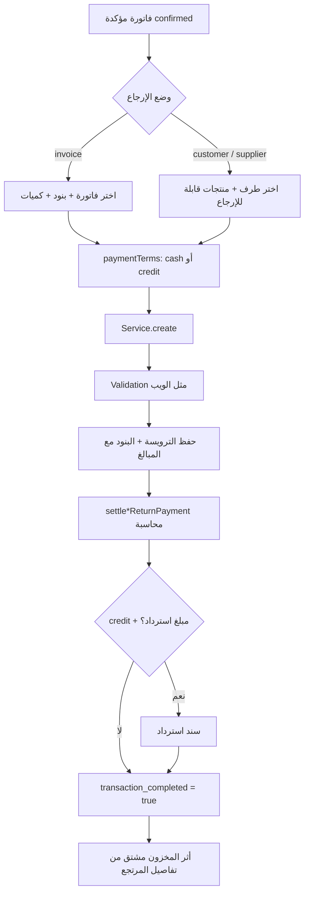

# مواصفة مردود المبيعات والمشتريات — مواءمة الموبايل 100% مع الويب

> **الغرض:** تدقيق دقيق + مرجع تنفيذ للموبايل لمردود المبيعات ومردود المشتريات (الإجراءات، الفلو، الفلاتر، المحاسبة، المخزون).  
> **الحالة:** ✅ مُحدَّث على Laravel ليطابق الويب.  
> **تفاصيل مبيعات:** [`docs/sales-returns-api-spec.md`](sales-returns-api-spec.md)  
> **تفاصيل مشتريات:** [`docs/purchases-returns-api-spec.md`](purchases-returns-api-spec.md)

---

## 0) الخلاصة التنفيذية

| الموضوع | مردود المبيعات | مردود المشتريات (قبل) | مردود المشتريات (بعد) |
|---------|----------------|------------------------|------------------------|
| وضع فاتورة | ✅ | ⚠️ CRUD ناقص | ✅ مثل الويب |
| وضع طرف (عميل/مورد) | ✅ customer | ❌ | ✅ supplier |
| تسعير بنود (price/tax/discount/total) | ✅ | ❌ | ✅ |
| paymentTerms cash/credit + استرداد | ✅ | ❌ | ✅ |
| محاسبة عند الإنشاء | ✅ | ❌ | ✅ |
| `transactionCompleted` | ✅ | ❌ | ✅ |
| GET show | ✅ | ❌ | ✅ |
| PATCH notes فقط | ✅ | كان يعدّل البنود | ✅ notes فقط |
| Helpers فواتير/بنود | ✅ | جزئي | ✅ |
| منتجات قابلة للإرجاع | ✅ للعميل | ❌ | ✅ للمورد |
| Delete | API نعم / ويب لا | API نعم / ويب نعم | كما هو |
| Confirm / Cancel / Print | غير موجود على الويب | غير موجود | غير موجود (لا نضيف للموبايل) |

**قاعدة ذهبية:** إنشاء المرتجع = تأكيد فوري. لا يوجد draft للمرتجع نفسه. الفاتورة الأصلية يجب أن تكون `confirmed`.

---

## 1) الفلو المشترك (ويب + موبايل)



### ما الذي يحدث محاسبياً؟

| النوع | cash | credit |
|-------|------|--------|
| **مبيعات** | مدين صندوق `120100001` ↔ دائن عميل | المتبقي على ذمم `121900001` + استرداد اختياري بسند صرف |
| **مشتريات** | مدين مورد ↔ دائن صندوق `120100001` | المتبقي على `121900001` + استرداد اختياري |

### أثر المخزون

- ليس خطوة منفصلة.
- كمية الفاتورة المتبقية تنقص عبر accessor على `InvoiceItem`.
- تقارير الحركة تعتبر `sales_return` / `purchase_return`.

---

## 2) المصادقة

```
Authorization: Bearer {token}
Tenant-Id: {tenant_id}
Accept: application/json
Content-Language: ar|en
```

**Base:** `/api/v1/tenant/shop/`

---

## 3) Endpoints — خريطة كاملة

### 3.1 مردود المبيعات

| Method | Path | يطابق الويب؟ |
|--------|------|-------------|
| GET | `sales-returns` | ✅ قائمة + فلاتر |
| GET | `sales-returns/{id}` | ✅ |
| POST | `sales-returns` | ✅ إنشاء + محاسبة |
| PATCH | `sales-returns/{id}` | ✅ `notes` فقط |
| DELETE | `sales-returns/{id}` | ⚠️ API فقط (الويب بلا حذف) |
| GET | `sales-returns-get-available-invoices` | ✅ |
| GET | `sales-returns-list-invoice-items-for-create/{no}` | ✅ |
| GET | `sales-returns-returnable-products/{customerId}` | ✅ |

### 3.2 مردود المشتريات

| Method | Path | يطابق الويب؟ |
|--------|------|-------------|
| GET | `purchases-returns` | ✅ |
| GET | `purchases-returns/{id}` | ✅ (أُضيف) |
| POST | `purchases-returns` | ✅ عبر `PurchaseReturnService` |
| PATCH | `purchases-returns/{id}` | ✅ `notes` فقط |
| DELETE | `purchases-returns/{id}` | ✅ مثل قائمة الويب |
| GET | `purchases-returns-get-available-invoices` | ✅ نفس منطق الويب (مرتجعات متعددة مسموحة إن بقي رصيد) |
| GET | `purchases-returns-list-invoice-items-for-create/{no}` | ✅ بنود قابلة للإرجاع فقط |
| GET | `purchases-returns-returnable-products/{supplierId}` | ✅ (أُضيف) |

---

## 4) فلاتر القائمة

### مبيعات — `GET sales-returns`

| Param | نوع | يطابق |
|-------|-----|-------|
| `client_id` أو `customer_id` | int | عميل |
| `invoice_no` | string | رقم فاتورة |
| `from_date` / `to_date` | `d-m-Y` | على `created_at` |
| `q` | string | بحث notes / رقم فاتورة / اسم عميل |

### مشتريات — `GET purchases-returns`

| Param | نوع | يطابق |
|-------|-----|-------|
| `supplier_id` | int | مورد (ترويسة أو عبر الفاتورة) |
| `invoice_no` | string | |
| `from_date` / `to_date` | `d-m-Y` | على `created_at` |
| `q` | string | notes / فاتورة / اسم مورد |

> ملاحظة: فلتر تاريخ الويب على مردود المبيعات كان يشير عمود `date` غير موجود؛ الموبايل والـ API يستخدمان `created_at` (السلوك الصحيح).

---

## 5) إنشاء مرتجع — Payload

### 5.1 وضع الفاتورة (مشترك)

```json
{
  "returnMode": "invoice",
  "invoiceNo": "SI-001",
  "paymentTerms": "cash",
  "pricesIncludesTaxes": true,
  "notes": "اختياري",
  "details": [
    { "invoiceItemId": 10, "qty": 2 }
  ]
}
```

Legacy (ما زال مدعوماً):
```json
{
  "invoice_no": "SI-001",
  "notes": "...",
  "items": [{ "id": 10, "qty": 2 }]
}
```

### 5.2 وضع العميل (مبيعات فقط)

```json
{
  "returnMode": "customer",
  "customerId": 5,
  "paymentTerms": "credit",
  "details": [
    { "productLineKey": "p:12|u:1", "qty": 1 }
  ],
  "creditPayment": {
    "accountCode": "120100001",
    "amount": 50,
    "date": "2026-08-26",
    "statement": "استرداد جزئي"
  }
}
```

### 5.3 وضع المورد (مشتريات فقط)

```json
{
  "returnMode": "supplier",
  "supplierId": 3,
  "paymentTerms": "cash",
  "details": [
    { "productLineKey": "p:12|u:1", "qty": 1 }
  ]
}
```

**السيرفر يحسب** `price` / `tax` / `discount` / `total` — لا ترسلها من الموبايل.

---

## 6) Response (شكل موحّد)

```json
{
  "id": 1,
  "returnMode": "invoice",
  "invoiceNo": "PI-10",
  "invoiceId": 20,
  "supplierId": 3,
  "supplierName": "مورد س",
  "paymentTerms": "cash",
  "refundAcc4Code": "120100001",
  "notes": null,
  "totalExTax": 100,
  "totalTax": 15,
  "totalDiscount": 0,
  "totalIncTax": 115,
  "createdAt": "...",
  "items": [
    {
      "id": 1,
      "invoiceItemId": 10,
      "name": "منتج",
      "qty": 2,
      "price": 100,
      "tax": 15,
      "discount": 0,
      "total": 115,
      "transactionCompleted": true,
      "unitPrice": "50.00"
    }
  ]
}
```

لمبيعات: `customerId` / `customerName` بدل المورد.

---

## 7) إجراءات من شاشة الفاتورة (موبايل)

### فاتورة مبيعات
1. `actions.canSalesReturn === true` (مؤكدة وغير مؤقتة)
2. إن وُجد مرتجع سابق يمكن فتحه عبر `salesReturnId` (أول مرتجع — مثل زر الويب)
3. أو إنشاء جديد: helpers ثم `POST sales-returns`
4. **متعدد المرتجعات** لنفس الفاتورة مسموح إذا بقيت كميات/مبالغ قابلة للإرجاع

### فاتورة مشتريات
1. `actions.canPurchaseReturn === true`
2. إن `purchasesReturnId` → `GET purchases-returns/{id}` (أول مرتجع — مثل زر الويب)
3. وإلا: `GET purchases-returns-list-invoice-items-for-create/{no}` ثم `POST`
4. متعدد المرتجعات مسموح محاسبياً طالما الإجمالي لا يتجاوز تكلفة البنود

---

## 8) ما لا يُبنى في الموبايل (غير موجود على الويب)

| إجراء | السبب |
|-------|--------|
| Confirm مرتجع | الإنشاء = التأكيد |
| Cancel / void مرتجع | غير موجود |
| تعديل البنود بعد الإنشاء | مقفول على الويب |
| تعديل paymentTerms بعد الإنشاء | مقفول |
| طباعة PDF للمرتجع | غير موجود على الويب |
| حذف مرتجع مبيعات من الواجهة | الويب لا يحذف — احذف من API فقط إن لزم بصلاحية |

---

## 9) جدول تدقيق القدرة ↔ الحالة

| القدرة | مبيعات ويب | مبيعات API | مشتريات ويب | مشتريات API |
|--------|------------|------------|-------------|-------------|
| List | ✅ | ✅ | ✅ | ✅ |
| Filters طرف / فاتورة / تاريخ | ✅* | ✅ | ✅ | ✅ |
| Search نصي | ✅ | ✅ `q` | ✅ | ✅ `q` |
| Show | عبر Edit | ✅ | عبر Edit | ✅ |
| Create invoice mode | ✅ | ✅ | ✅ | ✅ |
| Create party mode | ✅ customer | ✅ | ✅ supplier | ✅ |
| Pricing server-side | ✅ | ✅ | ✅ | ✅ |
| paymentTerms + credit refund | ✅ | ✅ | ✅ | ✅ |
| Accounting settle | ✅ | ✅ | ✅ | ✅ |
| Stock derived | ✅ | ✅ | ✅ | ✅ |
| Edit notes | ✅ | ✅ | ✅ | ✅ |
| Edit lines | ❌ | ❌ | ❌ | ❌ |
| Delete | ❌ | ⚠️ | ✅ | ✅ |
| Print | ❌ | ❌ | ❌ | ❌ |
| Helpers invoices/items | ✅ | ✅ | ✅ | ✅ |
| Returnable products | ✅ | ✅ | ✅ | ✅ |

\* فلتر تاريخ المبيعات على الويب كان معطوباً على عمود `date` — API يستخدم `created_at`.

---

## 10) ملفات المصدر

| دور | مبيعات | مشتريات |
|-----|--------|---------|
| Web Resource | `SalesReturnsResource` | `PurchasesReturnsResource` |
| Web Create | `CreateSalesReturns` | `CreatePurchasesReturns` |
| Shared logic | `InteractsWithInvoiceReturnLineItems` | نفس الـ trait |
| Service | `SalesReturnService` | **`PurchaseReturnService`** (جديد) |
| Workflow wrapper | `SalesReturnWorkflow` | يُعاد استخدامه |
| Controller | `SalesReturnsController` | `PurchasesReturnsController` |
| Store request | `StoreSalesReturnsRequest` | `StorePurchasesReturnsRequest` |

---

## 11) Checklist للموبايل

### مشترك
- [ ] لا شاشة draft/confirm للمرتجع
- [ ] لا تعديل بنود بعد الحفظ
- [ ] عرض `totalIncTax` وبنود مكتملة المبالغ
- [ ] دعم `paymentTerms` + `creditPayment` عند الآجل
- [ ] تواريخ الفلاتر بصيغة `d-m-Y`

### مبيعات
- [ ] وضعان: `invoice` و `customer`
- [ ] `GET sales-returns-returnable-products/{customerId}`
- [ ] عرض `customerName` في القائمة

### مشتريات
- [ ] وضعان: `invoice` و `supplier`
- [ ] `GET purchases-returns-returnable-products/{supplierId}`
- [ ] `GET purchases-returns/{id}` قبل فتح التفاصيل
- [ ] عرض `supplierName`
- [ ] لا تعتمد على منطق «مرتجع واحد فقط» — تحقق من الكميات المتاحة

---

## 12) ما تم إصلاحه في هذه الجولة

1. **مردود المشتريات** أصبح يمر عبر `PurchaseReturnService` بنفس فلو الويب (تسعير + محاسبة + credit refund + `transaction_completed`).
2. إضافة **وضع المورد** + endpoint المنتجات القابلة للإرجاع.
3. إضافة **`show`** للمشتريات.
4. **PATCH** للمشتريات = notes فقط (مثل المبيعات والويب).
5. Helpers الفواتير أصبحت كائنات غنية وليست map قديم، وتسمح بفواتير عليها مرتجعات جزئية.
6. Resources المشتريات تعرض totals / paymentTerms / supplierName.
7. تحسينات مبيعات: `customerName` + فلتر `customer_id` + بحث `q`.

---

*آخر تحديث: 2026-08-26 — تدقيق ومواءمة كاملة لمردود المبيعات والمشتريات.*
