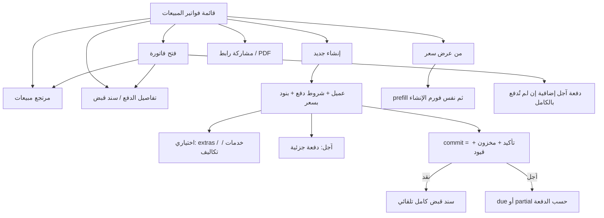

# مواصفة API فواتير المبيعات (Sales Invoices)

> **الغرض:** مرجع حصرّي لشاشة فواتير المبيعات **وكل الإجراءات التابعة لها** — مواءمة الموبايل مع الويب، ولـ Cursor.  
> **الحالة:** ✅ منفّذ على Laravel.  
> **مرتجع المبيعات (شاشة مستقلة تُفتح من صف الفاتورة):** [`docs/sales-returns-api-spec.md`](sales-returns-api-spec.md)  
> **العملاء (إنشاء سريع من الفورم):** [`docs/customers-api-spec.md`](customers-api-spec.md)  
> **عروض الأسعار (وحدة كاملة):** [`docs/price-offers-api-spec.md`](price-offers-api-spec.md)  
> **مرجع عام:** [`docs/mobile-api-parity-spec.md`](mobile-api-parity-spec.md)

**مهم:** مسار الـ API هو `sales` تحت `/api/v1/tenant/shop/`. لا تخلط مع طلبات المتجر `orders`.

---

## 1) مرجع الويب (مصدر الحقيقة)

| الملف | الدور |
|-------|--------|
| `app/Filament/Tenant/Resources/SalesInvoiceResource.php` | قائمة، فورم، أعمدة، **إجراءات الصف** |
| `.../Pages/CreateSalesInvoice.php` | إنشاء مؤكد + `confirmSalesInvoice()` + دفعة آجل + تحويل من عرض سعر |
| `.../Pages/EditSalesInvoice.php` | مقفول بعد التأكيد؛ تبويب الدفعات يبقى لدفعة آجل |
| `.../Pages/ListSalesInvoices.php` | إنشاء + **تحويل من عرض سعر** + حد الاشتراك |
| `InvoiceDocumentFormLayout` | تبويبات خصم / دفعات / خدمات / تكاليف إضافية + مشاركة رابط/PDF + مرتجع |
| `Invoice::confirmSalesInvoice()` | مخزون + قيود إيراد + **سند قبض كامل إذا نقد** |
| `InvoicePaymentTermsService` | نقد تلقائي / دفعة آجل |

القائمة في الويب تستخدم `listedInSalesModule()` = تستبعد مسودات الطلبات `status=sale_order`.

---

## 2) الفرق: API القديم vs الويب + API الحالي

| الموضوع | API القديم | الويب + API الحالي |
|---------|------------|---------------------|
| إنشاء | temp ثم add-item ثم `save` (يؤكد إن كانت قابلة للتعديل) | **`POST sales/commit`** فاتورة مؤكدة دفعة واحدة |
| `payment_terms` | ❌ | `cash` \| `credit` (افتراضي **credit**) |
| نقد | ❌ سند تلقائي | `confirmSalesInvoice` يستدعي `recordFullCashPayment` → الفاتورة **مدفوعة** |
| آجل | ❌ | `credit_payment` عند الإنشاء **أو** `POST sales/{id}/credit-payment` بعد القفل |
| خدمات | مسار temp فقط | داخل `commit` كمصفوفة `services` |
| إضافات المنتج (extras) | temp `extras[]` | `items[].extras` = IDs من `selectExtras` |
| مشاركة / PDF | ❌ | `shareUrl` + `pdfUrl` |
| مرتجع | شاشة منفصلة | `actions.canSalesReturn` + `salesReturnId` |
| إكمال الدفع | ❌ | `actions.canCompletePayment` + `receiptVoucherId` |
| من عرض سعر | ❌ | `GET price-offers-for-sales` ثم `sales-prefill` ثم `commit` |
| من طلب | رقم الطلب غير ظاهر | `orderNo` / `orderId` |
| `GET sales/{id}` | كان يفشل | تفاصيل كاملة + `actions` |
| قائمة | تشمل `sale_order` | مثل الويب: **بدون** مسودات الطلبات |

مسار temp القديم **ما زال يعمل**. الشاشات الجديدة تستخدم `commit`.

---

## 3) Headers و Base

```
Authorization: Bearer {token}
Tenant-Id: {tenant_id}
Accept: application/json
```

**Base:** `/api/v1/tenant/shop/`

**Envelope:** `{ statusCode, statusText, message, data, errors, locale }`

**Body:** snake_case. **JSON:** camelCase.

**تواريخ القائمة (legacy):** `d-m-Y` أو `Y-m-d`.  
**commit / credit_payment.date:** `Y-m-d` (يُقبل أيضاً `d-m-Y`).

---

## 4) شاشات الويب والإجراءات التابعة (إلزامي في الموبايل)



### 4.1 إجراءات صف القائمة (مثل `ActionGroup` في الويب)

كل صف في `GET sales` يرجع `actions` + روابط جاهزة. **لا تخفِ إجراء موجود في الويب.**

| إجراء الويب | متى يظهر | ماذا يفعل الموبايل |
|-------------|----------|---------------------|
| **رابط الفاتورة** | `actions.canShare` | انسخ/افتح `shareUrl`. زر تحميل: `pdfUrl` |
| **مرتجع مبيعات** | `actions.canSalesReturn` | إن `salesReturnId` موجود → شاشة تعديل المرتجع. وإلا → إنشاء مرتجع بوضع `invoice` و`invoiceId` = id الفاتورة. انظر [`sales-returns-api-spec.md`](sales-returns-api-spec.md) |
| **تفاصيل الدفع** | `actions.canCompletePayment` (`isPaid=false`) | إن `receiptVoucherId` → `GET/PATCH receipt-vouchers/{id}`. وإلا → `POST receipt-vouchers` مع `invoice_id` و`for=customer` |
| **دفعة آجل** | `actions.canCreditPayment` | `POST sales/{id}/credit-payment` (تبويب الدفعات في الويب يعمل بعد القفل) |
| فتح/عرض | دائماً | `GET sales/{id}` |

الويب **لا يحذف** فاتورة مبيعات من الجدول. لا تضع زر حذف.

### 4.2 أزرار أعلى القائمة (مثل الويب)

1. **إنشاء فاتورة** → فورم `commit`. معطّل إذا حد الاشتراك `sales_invoices`.
2. **إنشاء من عرض سعر** → `GET price-offers-for-sales` (قائمة غير منتهية) → اختيار → `GET price-offers/{id}/sales-prefill` → تعبئة الفورم → `commit`.

### 4.3 فورم الإنشاء (مطابقة الويب)

| الحقل | إلزامي | ملاحظات |
|-------|--------|---------|
| رقم الفاتورة | سيرفر | لا ترسل `no` |
| التاريخ | لا (افتراضي اليوم) | آخر 30 يوماً حتى اليوم |
| العميل | نعم | بحث `GET clients` + إنشاء سريع `POST clients` |
| `payment_terms` | لا | افتراضي `credit`. `cash` \| `credit` |
| بنود | نعم ≥ 1 | منتج + كمية 1–250000 + **سعر بيع** + خصم + ضريبة + extras |
| خدمات | لا | تبويب مستقل (المبيعات فقط، ليست في المشتريات) |
| تكاليف إضافية | لا | |
| دفعة آجل | لا | ظاهرة فقط إذا `credit` |

**بعد الحفظ:** `status=confirmed` و`lockedAt` مُعبأ. التعديل مقفول. النقد يُدفع كاملاً تلقائياً.

---

## 5) Endpoints

| Method | Path | الوصف |
|--------|------|--------|
| `GET` | `sales` | قائمة (غير temp، بدون `sale_order`) |
| `GET` | `sales/{id}` | تفاصيل + `actions` |
| `POST` | `sales/commit` | **إنشاء مؤكد دفعة واحدة** |
| `POST` | `sales/{id}/credit-payment` | دفعة آجل بعد التأكيد |
| `GET` | `price-offers-for-sales` | عروض غير منتهية لتحويلها لفاتورة |
| `GET` | `price-offers/{id}/sales-prefill` | JSON للفورم — لا ينشئ فاتورة |
| `POST` | `sales` | مسودة temp (legacy) |
| `POST` | `sales/add-item` … `delete-item` | legacy + `extras` |
| `POST` | `sales/add-service` … | legacy |
| `POST` | `sales/add-additional-cost` … | legacy |
| `POST` | `sales/apply-overall-discount` | legacy |
| `POST` | `sales/save` | legacy — يؤكد إن `isEditable` |
| `POST` | `sales/update-status` | legacy `confirmed` \| `cancelled` |
| `POST` | `sales-clear-temp-invoices` | حذف المسودات |
| `GET` | `clients/{id}/invoices` | فواتير العميل (شاشة العميل) |

`PUT`/`PATCH`/`DELETE sales/{id}` غير مدعومين.

### مسارات تابعة (ليست تحت `sales/` لكن جزء من الإجراءات)

| الإجراء | المسار | مواصفة |
|---------|--------|--------|
| مرتجع | `POST sales-returns` + helpers | [`sales-returns-api-spec.md`](sales-returns-api-spec.md) |
| سند قبض | `POST/GET receipt-vouchers` | أدناه §13 |
| حسابات تحصيل | `GET /api/v1/tenant/settings/utils/accounts/collection` | دفعة آجل |
| منتجات | `POST list-products-for-advanced-creation` `{ "for": "sales" }` | §8 |
| أنواع خدمات | `GET /api/v1/tenant/settings/services-types` | |
| تكاليف إضافية | `GET /api/v1/tenant/settings/additional-costs-types` | |
| ضرائب | `GET /api/v1/tenant/settings/tax-profiles` | |

---

## 6) GET — القائمة

```
GET /api/v1/tenant/shop/sales
```

**Query:** `search` (رقم فاتورة / اسم عميل / رقم طلب)، `customer_id`، `payment_terms`، `status` (`confirmed`\|`cancelled`)، `from_date`/`to_date`/`date`، `sort`، `paginate`، `per_page`، بالإضافة لفلاتر legacy (`payment_status`, `payment_method`, …).

**كل عنصر** يشمل الحقول القديمة **بالإضافة إلى:**

```json
{
  "id": 90,
  "no": "10459010",
  "status": "confirmed",
  "paymentTerms": "credit",
  "settlementStatusKey": "partial",
  "customerId": 4,
  "orderNo": "ORD-100",
  "shareUrl": "https://…/invoices/{uid}",
  "pdfUrl": "https://…/invoices/{uid}/pdf",
  "isPaid": false,
  "paidAmount": "100.00",
  "unpaidAmount": "50.00",
  "totalAmount": "150.00",
  "servicesTotal": "0.00",
  "hasSalesReturn": false,
  "salesReturnId": null,
  "receiptVoucherId": 12,
  "actions": {
    "canShare": true,
    "canSalesReturn": true,
    "canCompletePayment": true,
    "canCreditPayment": true,
    "canEdit": false
  }
}
```

`settlementStatusKey`: `cash` \| `paid` \| `due` \| `partial`.

---

## 7) POST — commit (المسار المعتمد)

```
POST /api/v1/tenant/shop/sales/commit
```

```json
{
  "customer_id": 4,
  "date": "2026-08-17",
  "payment_terms": "credit",
  "prices_includes_taxes": true,
  "items": [
    {
      "product_id": 12,
      "product_variant_id": null,
      "qty": 2,
      "price": 50,
      "discount": 0,
      "tax_profile_id": 3,
      "extras": [8, 9]
    },
    {
      "product_id": 15,
      "product_variant_id": 44,
      "qty": 1,
      "price": 80,
      "tax_profile_id": 3
    }
  ],
  "services": [
    {
      "service_type_id": 1,
      "price": 25,
      "description": "تركيب",
      "tax_profile_id": null
    }
  ],
  "additional_costs": [
    {
      "additional_cost_type_id": 1,
      "cost": 10,
      "statement": "توصيل",
      "tax_profile_id": null
    }
  ],
  "credit_payment": {
    "account_code": "120100001",
    "amount": 50,
    "date": "2026-08-17",
    "statement": "دفعة أولى"
  }
}
```

### قواعد

- `customer_id` + `items` إلزاميان.
- `price` هو سعر البيع (يُقبل أيضاً `unit_cost` كاسم بديل). الحد الأدنى `0.01`.
- `qty` 1–250000.
- منتج `type=variants`: **إلزامي** `product_variant_id` من `variants[].id` (أو `selected_variant_options_ids`).
- `extras` = IDs من `selectExtras` لنفس المنتج. السيرفر يحسب سعر الإضافة ويضيفه للضريبة.
- `payment_terms` افتراضي `credit`.
- **نقد `cash`:** بعد التأكيد يُنشأ سند قبض بكامل المبلغ. تجاهل `credit_payment`. `settlementStatusKey` عادة `cash`.
- **آجل:** بدون دفعة → `due`. دفعة جزئية → `partial`. تغطي الكل → `paid`.
- مخزون غير كافٍ (إذا تتبع المخزون مفعّل): خطأ من `confirmSalesInvoice` — لا تُحفظ الفاتورة.
- حد الاشتراك `sales_invoices`: `400`.
- العميل بلا حساب Acc4: فشل القيود.
- `201` + نفس شكل `GET sales/{id}`.

---

## 8) منتجات الفورم (variants + extras)

```
POST /api/v1/tenant/shop/list-products-for-advanced-creation
{ "for": "sales" }
```

للمبيعات تُرجع فقط منتجات لها سعر (`lastPrice`). مثال:

```json
{
  "id": 15,
  "type": "variants",
  "name": "تيشيرت",
  "taxProfileId": 3,
  "suggestedPrice": "80.00",
  "selectVariantOptions": [ { "variantLibraryName": "اللون", "options": [] } ],
  "variants": [
    {
      "id": 44,
      "productId": 15,
      "name": "أحمر / L",
      "sku": "TSH-R-L",
      "suggestedPrice": "80.00",
      "variantLibraryOptionsIds": [10, 21]
    }
  ],
  "selectExtras": [
    { "id": 8, "name": "طباعة", "price": "5.00" }
  ]
}
```

- `type=basic`: `product_id` + `suggestedPrice` كسعر افتراضي قابل للتعديل.
- `type=variants`: اختر من `variants[]`، السعر الافتراضي `variants[].suggestedPrice`. **لا** تركّب من `selectVariantOptions`.
- extras اختيارية متعددة؛ أرسل IDs في `items[].extras`.

---

## 9) GET — التفاصيل

```
GET /api/v1/tenant/shop/sales/{id}
```

نفس حقول القائمة + `items` (فيها `productId`, `productVariantId`, `selectedExtras`) + `services` + `additionalCosts`.

`date` / `createdAt` بقيت `F j, Y, g:i a` للتوافق مع التطبيق القديم.

---

## 10) دفعة آجل بعد التأكيد

الويب يسمح بتبويب الدفعات حتى بعد `lockedAt`.

```
POST /api/v1/tenant/shop/sales/{id}/credit-payment
```

```json
{
  "account_code": "120100001",
  "amount": 40,
  "date": "2026-08-17",
  "statement": "دفعة ثانية"
}
```

- فقط فاتورة مبيعات `confirmed` و`payment_terms=credit` وغير مدفوعة بالكامل.
- `amount` ≤ المتبقي. حسابات: `GET .../settings/utils/accounts/collection`.
- `200` + الفاتورة محدّثة (`paidAmount`, `receiptVoucherId`, `settlementStatusKey`).

---

## 11) التحويل من عرض سعر

**هذا إجراء قائمة المبيعات في الويب.** وحدة عروض الأسعار الكاملة (قائمة/إنشاء/تعديل/مشاركة/حذف) في [`docs/price-offers-api-spec.md`](price-offers-api-spec.md) — ابنِها كشاشة مستقلة.

من قائمة المبيعات يبقى التحويل كما يلي:

```
GET /api/v1/tenant/shop/price-offers-for-sales
```

```json
{ "id": 3, "no": "PO-1", "description": "عرض رمضان", "customerId": 4, "customerName": "أحمد", "expiresAt": "2026-09-01" }
```

فقط غير المنتهية (`notExpired`).

```
GET /api/v1/tenant/shop/price-offers/{id}/sales-prefill
```

يرجع العميل، البنود بالأسعار، extras، خدمات، تكاليف، خصم إجمالي. عبّئ الفورم (المستخدم يقدر يعدّل) ثم `POST sales/commit`.

عرض منتهٍ: `422` مع `price_offer_expired_cannot_convert`.

CRUD عروض الأسعار **شاشة مستقلة** — انظر المواصفة أعلاه. قائمة المبيعات تحتاج فقط منتقي التحويل + prefill.

---

## 12) مرتجع المبيعات (من صف الفاتورة)

لا تعِد بناء API المرتجع هنا.

1. `actions.canSalesReturn === true`
2. إن `salesReturnId` → `GET sales-returns/{salesReturnId}` (عرض/ملاحظات).
3. وإلا → تدفق الإنشاء في [`sales-returns-api-spec.md`](sales-returns-api-spec.md) وضع `returnMode: invoice` و`invoice_id` = id الفاتورة.
4. مساعدة: `GET sales-returns-list-invoice-items-for-create/{no}`.

الويب يسمح بأكثر من مرتجع جزئي لنفس الفاتورة.

---

## 13) إكمال الدفع (سند قبض)

يظهر الزر إذا `!isPaid`.

| الحالة | الإجراء |
|--------|---------|
| `receiptVoucherId` موجود | افتح سند القبض للتعديل / إضافة دفعة |
| لا يوجد | `POST /api/v1/tenant/shop/receipt-vouchers` |

جسم تقريبي لإنشاء سند مربوط بالفاتورة:

```json
{
  "no": "…",
  "date": "17-08-2026",
  "for": "customer",
  "invoice_id": 90,
  "acc4_code": "{customerAcc4Code}",
  "payments": [
    {
      "acc4_code": "120100001",
      "date": "17-08-2026",
      "amount": 50,
      "statement": "سداد فاتورة"
    }
  ]
}
```

`acc4_code` للرأس = حساب العميل (`customer.acc4Code` من `GET clients/{id}`).  
حساب التحصيل في سطر الدفع = `GET .../utils/accounts/collection`.

للفاتورة الآجلة، **فضّل** `POST sales/{id}/credit-payment` لأنه نفس منطق تبويب الفاتورة. سند القبض المنفصل يُستخدم إن كان التطبيق أصلاً يفتح شاشة السندات.

نقداً بعد `commit`: السند يُنشأ تلقائياً — لا تطلب من المستخدم الدفع مرة ثانية.

---

## 14) فاتورة قادمة من طلب (Order)

إن وُجد طلب مربوط: `orderId` + `orderNo` (وصف الصف في الويب: `Order No: …`).

لا تُنشأ هذه الفاتورة من شاشة المبيعات؛ تُعرض فقط. بعد التأكيد تكون مقفلة مثل البقية.

---

## 15) مسار temp القديم (لا تستخدمه في شاشات جديدة)

1. `POST sales` → `{ no, uid }`
2. add-item / add-service / additional-cost / discount
3. `POST sales/save` `{ uid, no, date: d-m-Y, customer_id, payment_terms? }` — **يؤكد** إن كانت غير مقفلة
4. أو `POST sales/update-status`

`add-item` ما زال يطلب `type` + `selected_variant_options_ids` و`unit_cost` min 1.

---

## 16) Prompt جاهز لـ Cursor (Flutter)

انسخ هذا البرومبت كما هو:

```
Implement Sales Invoices to match the MyBee web app using docs/sales-api-spec.md as the single source of truth. Also implement EVERY related row/header action from the web list and invoice screen.

Web: Filament SalesInvoiceResource.
API base: /api/v1/tenant/shop/
Auth: Bearer + Tenant-Id.

NEW create MUST use POST sales/commit. Do not use the temp draft flow for new UI.

Must implement:

A) List GET sales
- Columns: no (+ orderNo if present), customer, settlementStatusKey, date, paidAmount (+ percent), invoice total, optional services/additional costs.
- Search no / customer / order no.
- Row actions from data.actions (do not invent visibility):
  1. Share: copy/open shareUrl; download pdfUrl.
  2. Sales return: if salesReturnId open that return, else create sales-returns in invoice mode (docs/sales-returns-api-spec.md).
  3. Complete payment if canCompletePayment: receipt voucher via receiptVoucherId or POST receipt-vouchers with invoice_id.
  4. Credit payment if canCreditPayment: POST sales/{id}/credit-payment.
- Header: Create; Convert from price offer (GET price-offers-for-sales → GET price-offers/{id}/sales-prefill → commit).

B) Create form
- customer (GET/POST clients), payment_terms default credit, date Y-m-d last 30 days.
- Lines: POST list-products-for-advanced-creation { "for": "sales" }. Show basic AND variants. Variants: pick variants[].id as product_variant_id. Default price = suggestedPrice (line) or variants[].suggestedPrice. Optional extras[] from selectExtras (ids + price display). qty 1–250000.
- Tabs: services (GET settings/services-types), additional costs, credit payment only if credit (collection accounts from GET settings/utils/accounts/collection).
- Cash: after commit invoice is paid automatically — do not collect a second payment.
- Stock errors from server: show message, do not keep a draft.

C) Show GET sales/{id}. Locked after confirm (canEdit false). Still allow credit-payment and sales-return and share.

D) Sales list still needs the convert picker + prefill. The full Price Offers module is a separate screen — implement it from docs/price-offers-api-spec.md (do not skip it).

Body snake_case, response camelCase.
```

---

## 17) QA

| # | سيناريو | المتوقع |
|---|---------|---------|
| 1 | `commit` عميل + بند بسعر | `201`، `confirmed`، `lockedAt`، حركة مخزون |
| 2 | `payment_terms=cash` | `isPaid=true`، `receiptVoucherId`، `settlementStatusKey=cash` |
| 3 | آجل بدون دفعة | `due`، غير مدفوعة |
| 4 | آجل + دفعة جزئية | `partial` + سند |
| 5 | `POST credit-payment` بعد القفل | يزيد المدفوع |
| 6 | منتج variants بدون `product_variant_id` | `422` |
| 7 | extras لا تتبع المنتج | `422` |
| 8 | كمية أكبر من المخزون (تتبع مفعّل) | خطأ، لا فاتورة |
| 9 | حد الاشتراك | `400` |
| 10 | prefill عرض منتهٍ | `422` |
| 11 | prefill ثم commit | نفس العميل/البنود/الخدمات |
| 12 | `shareUrl` / `pdfUrl` | يفتحان الصفحة العامة / PDF |
| 13 | `canSalesReturn` | يفتح إنشاء مرتجع للفاتورة |
| 14 | قائمة | لا تظهر `sale_order` |
| 15 | مسار temp القديم | ما زال يعمل |

---

*آخر تحديث: 2026-08-17.*
