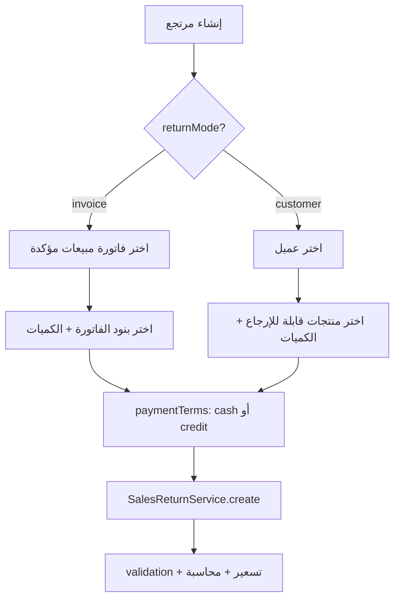

# مواصفة API مرتجع المبيعات (Sales Returns)

> **الغرض:** مرجع حصرّي لمرتجع المبيعات — للتحقق من مواءمة API الموبايل مع الويب، ولاستخدامه في Cursor عند بناء/مراجعة الشاشات.  
> **الحالة:** ✅ منفّذ على Laravel — هذا الملف يوثّق **السلوك الفعلي** وليس المطلوب فقط.  
> **مرجع عام:** [`docs/mobile-api-parity-spec.md`](mobile-api-parity-spec.md) (§3 — ملخص قديم)

---

## 1) مرجع الويب (مصدر الحقيقة)

| الملف | الدور |
|-------|--------|
| `app/Filament/Tenant/Resources/SalesReturnsResource.php` | النموذج، validation، helpers |
| `app/Filament/Tenant/Resources/SalesReturnsResource/Pages/CreateSalesReturns.php` | ترتيب الحفظ بعد الإنشاء |
| `app/Filament/Tenant/Concerns/InteractsWithInvoiceReturnLineItems.php` | تسعير، توسيع بنود، محاسبة |
| `app/Filament/Tenant/Concerns/HandlesReturnCreditPayments.php` | استرداد آجل (credit refund) |

**API (لا تعدّل الويب — أعد استخدامه):**

| الملف | الدور |
|-------|--------|
| `app/Services/SalesReturnService.php` | `create()` — نقطة الدخول للـ POST |
| `app/Services/SalesReturnWorkflow.php` | Wrapper للـ trait (بدون لمس Filament) |
| `app/Http/Controllers/API/V1/SalesReturnsController.php` | Endpoints |
| `app/Http/Requests/StoreSalesReturnsRequest.php` | Validation الطلب |
| `app/Http/Resources/SalesReturnsResource.php` | Response JSON |

---

## 2) الفرق الجوهري: الويب vs API (قبل/بعد)

| الموضوع | API القديم | الويب + API الحالي |
|---------|------------|---------------------|
| **وضع الإرجاع** | فاتورة فقط | `invoice` **أو** `customer` |
| **مرتجع لنفس الفاتورة** | مرفوض (مرة واحدة) | **مسموح** — جزئي/متعدد |
| **حقول السطر** | `qty` فقط | `price`, `tax`, `discount`, `total` (محسوبة) |
| **`paymentTerms`** | ❌ | `cash` \| `credit` + استرداد |
| **محاسبة** | ❌ | `settleSalesReturnPayment()` + قيود |
| **`transactionCompleted`** | ❌ | `true` بعد الإنشاء |
| **PATCH** | تعديل بنود | **`notes` فقط** (مثل الويب) |

---

## 3) المصادقة والـ Headers

```
Authorization: Bearer {token}
Tenant-Id: {tenant_id}
Accept: application/json
Content-Language: ar|en  (اختياري)
```

**Base path:** `/api/v1/tenant/shop/`

**Response envelope (مثل باقي API):**
```json
{
  "statusCode": 200,
  "statusText": "...",
  "message": "...",
  "data": { ... },
  "errors": [],
  "locale": "ar"
}
```

---

## 4) أوضاع الإرجاع (Return Mode)



### 4.1 وضع الفاتورة — `returnMode: "invoice"`

- يرتبط بفاتورة مبيعات **مؤكدة** (`status = confirmed`, `temp = false`).
- يمكن إرجاع **جزء** من البنود أو إنشاء **أكثر من مرتجع** لنفس الفاتورة.
- `customerId` يُستنتج من الفاتورة (لا يلزم إرساله).

### 4.2 وضع العميل — `returnMode: "customer"`

- **بدون** فاتورة — `invoiceId` / `invoiceNo` = `null` في الـ response.
- يُختار العميل ثم منتجات سبق للعميل شراؤها (مجمّعة حسب product line key).
- `productLineKey` — نفس المفتاح الذي يولّده الويب في `returnableProductOptionsForCustomer()`.

---

## 5) Endpoints — قائمة كاملة

| Method | Path | الوصف |
|--------|------|--------|
| `GET` | `sales-returns` | قائمة المرتجعات + فلاتر |
| `GET` | `sales-returns/{id}` | تفاصيل مرتجع |
| `POST` | `sales-returns` | إنشاء مرتجع |
| `PATCH` | `sales-returns/{id}` | تحديث `notes` فقط |
| `DELETE` | `sales-returns/{id}` | حذف (API فقط) |
| `GET` | `sales-returns-get-available-invoices` | فواتير قابلة للإرجاع |
| `GET` | `sales-returns-list-invoice-items-for-create/{no}` | بنود فاتورة للإرجاع |
| `GET` | `sales-returns-returnable-products/{customerId}` | منتجات قابلة للإرجاع لعميل |

---

## 6) GET — مسارات المساعدة (Create Flow)

### 6.1 فواتير قابلة للإرجاع

```
GET /api/v1/tenant/shop/sales-returns-get-available-invoices
```

**Logic (مثل الويب):** `SalesReturnWorkflow::returnableInvoiceOptions('sales', true)`  
- فواتير مبيعات مؤكدة، غير temp.  
- **تشمل** فواتير لها مرتجعات سابقة (partial returns).

**Response `data[]`:**
```json
{
  "id": 10,
  "no": "INV-2024-001",
  "label": "INV-2024-001 — أحمد",
  "customerId": 5,
  "customerName": "أحمد",
  "paymentTerms": "cash",
  "paidAmount": 1150.0
}
```

### 6.2 بنود فاتورة (invoice mode)

```
GET /api/v1/tenant/shop/sales-returns-list-invoice-items-for-create/{invoiceNo}
```

**Response `data[]`:**
```json
{
  "id": 15,
  "invoiceItemId": 15,
  "name": "منتج أ",
  "unitPrice": "100.00",
  "maxQty": 5.0,
  "returnableQty": 3.0
}
```

> `returnableQty` = الكمية المتبقية القابلة للإرجاع بعد خصم المرتجعات السابقة.

### 6.3 منتجات عميل (customer mode)

```
GET /api/v1/tenant/shop/sales-returns-returnable-products/{customerId}
```

**Response `data[]`:**
```json
{
  "productLineKey": "product_12_unit_1",
  "name": "منتج أ — قطعة",
  "returnableQty": 2.0
}
```

---

## 7) GET — قائمة وعرض

### 7.1 Index

```
GET /api/v1/tenant/shop/sales-returns
```

**Query params:**

| Param | Type | Notes |
|-------|------|-------|
| `client_id` | int | عميل — يطابق `customer_id` على المرتجع أو فاتورته |
| `invoice_no` | string | رقم فاتورة |
| `from_date` | string | `d-m-Y` — على **`created_at`** |
| `to_date` | string | `d-m-Y`, بعد `from_date` |

### 7.2 Show

```
GET /api/v1/tenant/shop/sales-returns/{id}
```

---

## 8) POST — إنشاء مرتجع

```
POST /api/v1/tenant/shop/sales-returns
```

### 8.1 Body — وضع الفاتورة (موصى)

```json
{
  "returnMode": "invoice",
  "invoiceNo": "INV-2024-001",
  "notes": "مرتجع جزئي",
  "paymentTerms": "cash",
  "pricesIncludesTaxes": true,
  "details": [
    { "invoiceItemId": 15, "qty": 2 }
  ]
}
```

### 8.2 Body — وضع العميل

```json
{
  "returnMode": "customer",
  "customerId": 12,
  "paymentTerms": "credit",
  "pricesIncludesTaxes": true,
  "details": [
    { "productLineKey": "product_12_unit_1", "qty": 1 }
  ],
  "creditPayment": {
    "accountCode": "120100001",
    "amount": 115.0,
    "date": "2026-08-05",
    "statement": "استرداد للعميل"
  }
}
```

### 8.3 Body — توافق خلفي (موبايل قديم)

```json
{
  "invoice_no": "INV-2024-001",
  "items": [
    { "id": 15, "qty": 2 }
  ]
}
```

يُحوَّل داخلياً إلى `returnMode=invoice` ويمرّ عبر **`SalesReturnService` الكامل** (تسعير + محاسبة).

### 8.4 حقول الطلب

| Field | invoice | customer | Default / Notes |
|-------|---------|----------|-----------------|
| `returnMode` / `return_mode` | ✓ | ✓ | `invoice` |
| `invoiceNo` / `invoice_no` | **required** | — | exists in `invoices.no` |
| `invoiceId` / `invoice_id` | optional | — | بديل لـ `invoiceNo` |
| `customerId` / `customer_id` | — | **required** | exists in `customers` |
| `details` | ✓ (أو `items` legacy) | **required** | min 1 |
| `details[].invoiceItemId` | **required** | — | belongs to invoice |
| `details[].productLineKey` | — | **required** | من helper §6.3 |
| `details[].qty` | **required** | **required** | > 0, ≤ available |
| `notes` | optional | optional | |
| `paymentTerms` / `payment_terms` | optional | optional | `cash` \| `credit` |
| `pricesIncludesTaxes` | optional | optional | default `true` |
| `creditPayment` | if credit | if credit | see §9 |

**camelCase و snake_case** مدعومان في الطلب.

### 8.5 ترتيب التنفيذ (مطابق للويب)

```
1. normalizePayload()
2. SalesReturnsResource::validateReturnDetailsForCreate()
3. SalesReturns::create + details (invoice mode)
4. syncExpandedReturnDetails()
5. settleSalesReturnPayment()
6. recordSalesReturnCreditRefund()  ← إذا credit
7. transaction_completed = true  ← لكل detail
```

### 8.6 أخطاء شائعة (422)

| Key | السبب |
|-----|--------|
| `details` | فاتورة غير مؤكدة، كمية تتجاوز المتاح، مجموع أكبر من المدفوع |
| `invoiceNo` | فاتورة مطلوبة في invoice mode |
| `creditPayment` | مبلغ الاسترداد > إجمالي المرتجع |

---

## 9) شروط الدفع — `paymentTerms`

| القيمة | السلوك |
|--------|--------|
| `cash` | `refundAcc4Code` = `120100001` (خزينة) — استرداد نقدي |
| `credit` | يتطلب `creditPayment` — سند/حركة استرداد للعميل |

**`creditPayment` object:**

```json
{
  "accountCode": "120100001",
  "amount": 500.0,
  "date": "2026-08-05",
  "statement": "نص اختياري"
}
```

- `amount` ≤ إجمالي المرتجع.
- `accountCode` — حساب الخزينة/البنك للصرف.

---

## 10) Response — `SalesReturnsResource`

```json
{
  "id": 1,
  "returnMode": "invoice",
  "invoiceNo": "INV-2024-001",
  "invoiceId": 10,
  "customerId": 5,
  "paymentTerms": "cash",
  "refundAcc4Code": "120100001",
  "notes": "...",
  "totalExTax": 100.0,
  "totalTax": 15.0,
  "totalDiscount": 0.0,
  "totalIncTax": 115.0,
  "createdAt": "August 5, 2026, 2:00 pm",
  "items": [
    {
      "id": 1,
      "invoiceItemId": 15,
      "name": "منتج أ",
      "qty": 2.0,
      "price": 100.0,
      "tax": 15.0,
      "discount": 0.0,
      "total": 115.0,
      "transactionCompleted": true,
      "unitPrice": "50.00"
    }
  ],
  "user": { "id": 1, "fullName": "..." }
}
```

**customer mode:** `invoiceNo` و `invoiceId` = `null`.

---

## 11) PATCH / DELETE

### PATCH — `notes` فقط

```
PATCH /api/v1/tenant/shop/sales-returns/{id}
Body: { "notes": "تحديث الملاحظة" }
```

> **لا ترسل** `details` أو `items` — مرفوض/متجاهل (مثل الويب).

### DELETE

```
DELETE /api/v1/tenant/shop/sales-returns/{id}
```

- API-only؛ قد يرفض إذا `canDelete` = false أو السجل مستخدم.

---

## 12) تدفق شاشة الموبايل (مقترح)

### Invoice mode
1. `GET sales-returns-get-available-invoices`
2. المستخدم يختار فاتورة
3. `GET sales-returns-list-invoice-items-for-create/{no}`
4. المستخدم يحدد الكميات + `paymentTerms`
5. `POST sales-returns`

### Customer mode
1. المستخدم يختار عميل (من API العملاء)
2. `GET sales-returns-returnable-products/{customerId}`
3. المستخدم يحدد المنتجات + الكميات
4. إذا `credit` → نموذج `creditPayment`
5. `POST sales-returns` مع `returnMode: "customer"`

---

## 13) QA Checklist

| # | السيناريو | المتوقع |
|---|-----------|---------|
| 1 | POST invoice + cash | `items[].price/tax/total` ≠ 0, `transactionCompleted: true` |
| 2 | POST مرتجع ثانٍ لنفس الفاتورة | ✅ ينجح |
| 3 | POST customer mode | `invoiceNo: null`, بنود بـ `productLineKey` |
| 4 | qty > returnableQty | 422 على `details` |
| 5 | فاتورة غير مؤكدة | 422 |
| 6 | credit + amount > total | 422 على `creditPayment` |
| 7 | PATCH notes | ينجح؛ البنود لا تتغير |
| 8 | Legacy `items` + `invoice_no` | ينجح مع تسعير كامل |

---

## 14) Prompt جاهز لـ Cursor (انسخه)

```
راجع/نفّذ شاشة مرتجع المبيعات في الموبايل حسب docs/sales-returns-api-spec.md:

1. وضعان: returnMode invoice | customer — نفس الويب.
2. Create flow:
   - invoice: get-available-invoices → list-invoice-items → POST
   - customer: returnable-products/{customerId} → POST
3. POST يمر عبر SalesReturnService — لا تحسب price/tax/total في الموبايل.
4. paymentTerms cash | credit — credit يتطلب creditPayment.
5. PATCH notes فقط — لا تعديل بنود.
6. backward compat: items + invoice_no ما زال يعمل.

Rules: camelCase في JSON، Tenant-Id header، لا تكسر payload القديم.
```

---

## 15) قواعد للمطور

1. **لا تكرر منطق التسعير/المحاسبة في الموبايل** — أرسل `qty` فقط؛ السيرفر يحسب الباقي.
2. **لا تفترض** وجود `invoiceNo` — تحقق من `returnMode`.
3. **استخدم** `returnableQty` من helpers قبل السماح بإدخال الكمية.
4. **لا تعدّل** ملفات Filament للمواءمة — وسّع `SalesReturnService` فقط.
5. أي تغيير سلوكي يجب أن يطابق `CreateSalesReturns::afterCreate()`.

---

*آخر تحديث: 2026-08-05 — فرع `local-dev-updates`*
