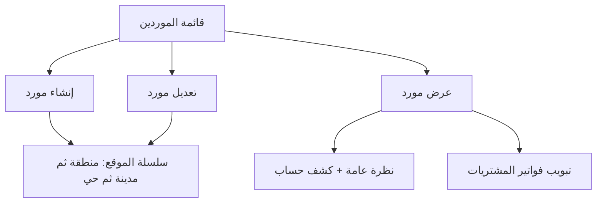

# مواصفة API الموردين (Suppliers)

> **الغرض:** مرجع حصرّي لشاشة الموردين — للتحقق من مواءمة تطبيق الموبايل مع الويب، ولاستخدامه في Cursor عند بناء/مراجعة الشاشات.  
> **الحالة:** ✅ منفّذ على Laravel — هذا الملف يوثّق **السلوك الفعلي** بعد مواءمة API مع الويب.  
> **مرجع عام:** [`docs/mobile-api-parity-spec.md`](mobile-api-parity-spec.md)  
> **شاشة مشابهة:** [`docs/customers-api-spec.md`](customers-api-spec.md) — نفس فورم جهات الاتصال.  
> **فواتير المشتريات:** [`docs/purchases-api-spec.md`](purchases-api-spec.md)

**مهم:** استخدم `/api/v1/tenant/shop/suppliers`. لا تخلط مع `/api/v1/tenant/settings/suppliers` (نفس الـ CRUD الأساسي، بدون كشف الحساب/التبويبات).

---

## 1) مرجع الويب (مصدر الحقيقة)

| الملف | الدور |
|-------|--------|
| `app/Filament/Tenant/Resources/SupplierResource.php` | قائمة، فلتر تاريخ، عرض/تعديل (بدون حذف في الجدول) |
| `app/Filament/Tenant/Concerns/PartyContactFormSchema.php` | فورم الإنشاء/التعديل (مشترك مع العملاء) |
| `app/Filament/Tenant/Resources/SupplierResource/Pages/ViewSupplier.php` | صفحة العرض + كشف الحساب |
| `resources/views/filament/tenant/resources/suppliers/partials/overview-content.blade.php` | بطاقات النظرة العامة + جدول الكشف |
| `app/Filament/Tenant/Resources/SupplierResource/RelationManagers/PurchaseInvoicesRelationManager.php` | تبويب فواتير المشتريات |
| `app/Services/SupplierAccountStatementService.php` | منطق كشف الحساب |

**API (لا تعدّل الويب — أعد استخدام الخدمات نفسها):**

| الملف | الدور |
|-------|--------|
| `app/Http/Controllers/API/V1/SupplierController.php` | Endpoints |
| `app/Http/Requests/StoreSupplierRequest.php` / `UpdateSupplierRequest.php` | Validation |
| `app/Http/Resources/SupplierResource.php` | Response JSON |
| `app/Services/SupplierAccountStatementService.php` | كشف الحساب |

الحساب المحاسبي: `acc3_code = 1214` (الدائنون / الموردون) — يُنشأ تلقائياً عبر `HasFinancialAccount`.

---

## 2) الفرق: API القديم vs الويب + API الحالي

| الموضوع | API القديم | الويب + API الحالي |
|---------|------------|---------------------|
| **فورم الموقع** | `state_id/city_id/area_id` في الإنشاء فقط، والرد بدونها | نفس `PartyContactFormSchema` في الطلب **والرد** |
| **تعديل الموقع / TRN / رمز بريدي** | ❌ غير موجود في PATCH | موجود |
| **عنوان التوصيل** | `address` فقط | `deliveryAddress` (+ `address` للتوافق) و `location` محسوب |
| **`acc4Code`** | `$this->acc4->code` يكسر إذا ما في حساب | `acc4?->code` |
| **كشف الحساب** | ❌ | `GET .../suppliers/{id}/account-statement` |
| **نظرة عامة** | ❌ | `overview` داخل `GET .../suppliers/{id}` |
| **فواتير المشتريات** | ❌ | `GET .../suppliers/{id}/purchase-invoices` |
| **أوامر التوريد** | ❌ | `GET .../suppliers/{id}/supply-orders` |
| **فلاتر القائمة** | بدون بحث/تاريخ | `search` + `from_date` + `to_date` |
| **الموقع** | مسار المتجر | `GET .../shop/location/*` (نفس العملاء) |

---

## 3) المصادقة والـ Headers

```
Authorization: Bearer {token}
Tenant-Id: {tenant_id}
Accept: application/json
Content-Language: ar|en  (اختياري)
```

**Base path:** `/api/v1/tenant/shop/`

**Response envelope:** نفس باقي API (`statusCode`, `data`, `errors`, `locale`).

**تواريخ هذا الموديول:** `Y-m-d` (مثل الويب والعملاء).

---

## 4) شاشات الويب التي يجب أن يطابقها التطبيق



### 4.1 القائمة

أعمدة الويب: الاسم، الهاتف، عنوان التوصيل، الإيميل، تاريخ التحديث، تاريخ الإنشاء.

بحث: `name`, `phone`, `delivery_address`, `email`.  
فلتر: `created_from` / `created_until` على `created_at`.

الويب **لا يعرض زر حذف** في الجدول (عرض + تعديل فقط). الـ API ما زال فيه `DELETE` إذا احتجتموه.

### 4.2 الإنشاء / التعديل (نفس فورم العملاء)

الحقول من `PartyContactFormSchema`:

| حقل الويب | Body API | إلزامي | ملاحظات |
|-----------|----------|--------|---------|
| اسم المورد | `name` | ✅ | فريد داخل الـ tenant |
| الهاتف | `phone` | ❌ | اختياري، صيغة دولية. مثال: `9665xxxxxxxx` |
| الرقم الضريبي | `trn` | ❌ | في الفورم؛ صفحة العرض لا تُظهره |
| الإيميل | `email` | ❌ | |
| الرمز البريدي | `postal_code` | ❌ | max 20 |
| المنطقة | `state_id` | ❌ | `GET location/states` |
| المدينة | `city_id` | ❌ | أخفِ إذا `hasCities` = false |
| الحي | `area_id` | ❌ | أخفِ إذا `hasAreas` = false |
| عنوان التوصيل | `delivery_address` | ❌ | نص الشارع |

**حقول قديمة في الـ API (ليست في فورم الويب الحالي):** `company`, `notes`, `address`.  
صفحة العرض تُظهر `company` و `notes` إذا وُجدا. لا تضيفها للفورم إلا إذا أردت أكثر من الويب. إذا أُرسل `address` بدون `delivery_address` ينسخه السيرفر إلى `delivery_address`.

**لا يُرسلها التطبيق:** `tenant_id`، حساب Acc4.

**سلسلة الموقع:** نفس العملاء تماماً — استخدم `GET shop/location/states|cities|areas` **وليس** `/store/location/*`.

### 4.3 صفحة العرض

1. **بروفايل + بطاقات:** الاسم، الشركة (إن وُجدت)، هاتف، إيميل، رمز بريدي، الموقع، عنوان التوصيل، تاريخ الانضمام، رقم الحساب، عدد أوامر التوريد، عدد فواتير المشتريات المؤكدة، غير المسدد، الرصيد المستحق للمورد.
2. **كشف الحساب:** من/إلى + جدول (افتتاحي، مدين، دائن، رصيد) — روابط الفواتير تذهب لفاتورة **مشتريات**.
3. **تبويب واحد في الويب:** فواتير المشتريات (`canCreate = false`).

إذا `overview.hasAccount = false`: رسالة «لا يوجد حساب محاسبي مرتبط بهذا المورد».

`currentBalance` > 0 = عليه رصيد مستحق للمورد (شارة الويب).

---

## 5) Endpoints — قائمة كاملة

| Method | Path | الوصف |
|--------|------|--------|
| `GET` | `suppliers` | قائمة + بحث/تاريخ |
| `POST` | `suppliers` | إنشاء |
| `GET` | `suppliers/{id}` | تفاصيل + `overview` |
| `PUT` / `PATCH` | `suppliers/{id}` | تعديل |
| `DELETE` | `suppliers/{id}` | حذف (غير ظاهر في جدول الويب) |
| `GET` | `suppliers/{id}/account-statement` | كشف الحساب |
| `GET` | `suppliers/{id}/purchase-invoices` | فواتير المشتريات |
| `GET` | `suppliers/{id}/supply-orders` | أوامر التوريد (بطاقة العدد) |
| `GET` | `location/states` | مناطق الفورم |
| `GET` | `location/cities?state_id=` | مدن المنطقة |
| `GET` | `location/areas?city_id=` | أحياء المدينة |

---

## 6) GET — القائمة

```
GET /api/v1/tenant/shop/suppliers
```

**Query:** `search`, `from_date`, `to_date` (`Y-m-d`), `sort` = `latest`\|`oldest`, `paginate`, `per_page`.

**Response `data[]`:**
```json
{
  "id": 7,
  "name": "مؤسسة الإمداد",
  "phone": "966512345678",
  "email": "supply@example.com",
  "trn": "300000000000003",
  "company": "الإمداد التجارية",
  "notes": null,
  "postalCode": "12345",
  "address": "حي الصناعية",
  "deliveryAddress": "شارع المصانع، مستودع 4",
  "location": "الرياض - الرياض - الصناعية",
  "stateId": 1,
  "cityId": 10,
  "areaId": 44,
  "state": { "id": 1, "name": "الرياض", "countryId": 1, "hasCities": true },
  "city": { "id": 10, "name": "الرياض", "stateId": 1, "hasAreas": true },
  "area": { "id": 44, "name": "الصناعية", "cityId": 10 },
  "acc4Code": "1214000001",
  "supplyOrdersCount": 2,
  "purchaseInvoicesCount": 5,
  "canDelete": true,
  "createdAt": "2026-03-01 09:15:00",
  "updatedAt": "2026-03-01 09:15:00"
}
```

`deliveryAddress` = `delivery_address` أو `address` القديم إذا الأول فارغ.  
`location` = المنطقة − المدينة − الحي.  
`createdAt` صار `Y-m-d H:i:s` (كان نص إنجليزي مثل `March 1, 2026, 9:15 am`).

---

## 7) POST — إنشاء

```
POST /api/v1/tenant/shop/suppliers
```

**الحد الأدنى:** `{ "name": "مؤسسة الإمداد" }`

```json
{
  "name": "مؤسسة الإمداد",
  "phone": "966512345678",
  "email": "supply@example.com",
  "trn": "300000000000003",
  "postal_code": "12345",
  "state_id": 1,
  "city_id": 10,
  "area_id": 44,
  "delivery_address": "شارع المصانع، مستودع 4"
}
```

- `city_id` يجب أن يتبع `state_id`؛ `area_id` يتبع `city_id`.
- `201` + `acc4Code` غير فارغ.

---

## 8) GET — التفاصيل + النظرة العامة

```
GET /api/v1/tenant/shop/suppliers/{id}
```

نفس حقول القائمة **إضافة إلى** `overview`:

```json
{
  "overview": {
    "hasAccount": true,
    "accountCode": "1214000001",
    "supplyOrdersCount": 2,
    "purchaseInvoicesCount": 5,
    "unpaidTotal": 1200.00,
    "currentBalance": 1200.00,
    "currency": "SAR"
  }
}
```

`purchaseInvoicesCount` = فواتير مشتريات **مؤكدة** غير temp (نفس بطاقة الويب).

---

## 9) PATCH — تعديل

```
PATCH /api/v1/tenant/shop/suppliers/{id}
```

أرسل الفورم كاملاً. عند تغيير المنطقة أرسل `city_id: null` و `area_id: null` إن لم تُختر مدينة جديدة.

---

## 10) DELETE

```
DELETE /api/v1/tenant/shop/suppliers/{id}
```

- `200` حُذف.
- `400` السجل مستخدم.
- `403` لا صلاحية.

الويب لا يعرض الحذف في القائمة — أخفه في التطبيق لتطابق الويب.

---

## 11) GET — كشف الحساب

```
GET /api/v1/tenant/shop/suppliers/{id}/account-statement?from=2026-01-01&to=2026-08-16
```

**الافتراضي:** `from` = أول السنة، `to` = اليوم.  
**Logic:** `SupplierAccountStatementService::build()`.

```json
{
  "hasAccount": true,
  "supplierName": "مؤسسة الإمداد",
  "accountCode": "1214000001",
  "from": "2026-01-01",
  "to": "2026-08-16",
  "currency": "SAR",
  "openingBalance": 0.0,
  "totalDebit": 500.0,
  "totalCredit": 1700.0,
  "closingBalance": 1200.0,
  "currentBalance": 1200.0,
  "supplyOrdersCount": 2,
  "purchaseInvoicesCount": 5,
  "unpaidTotal": 1200.0,
  "lines": [
    {
      "id": 88,
      "date": "2026-04-02",
      "voucherNo": "PV-00009",
      "statement": "سند صرف ...",
      "debit": 0.0,
      "credit": 500.0,
      "balance": 1200.0,
      "invoiceId": 22,
      "invoiceNo": "PINV-00022"
    }
  ]
}
```

عرض الجدول مثل العملاء: صف افتتاحي إذا `openingBalance != 0`، شرطة بدل صفر للمدين/الدائن، `invoiceNo` يفتح فاتورة **مشتريات**.

بدون حساب:
```json
{ "hasAccount": false, "message": "لا يوجد حساب محاسبي مرتبط بهذا المورد." }
```
HTTP `200`.

---

## 12) GET — فواتير المشتريات (تبويب الويب)

```
GET /api/v1/tenant/shop/suppliers/{id}/purchase-invoices
```

نفس الويب: `type=purchases`, `temp=false`.

**Query:** `status` = `purchase_order` \| `cancelled` \| `confirmed`، `from_date`, `to_date`, `search` (رقم الفاتورة).

```json
{
  "id": 22,
  "no": "PINV-00022",
  "status": "confirmed",
  "settlementStatusKey": "partial",
  "settlementStatus": "مسدد جزئيا",
  "date": "2026-04-02",
  "paidAmount": 500.0,
  "unpaidAmount": 1200.0,
  "invoiceTotal": 1700.0,
  "currency": "SAR",
  "isPaid": false,
  "hasPurchaseReturn": false,
  "purchasesReturnsCount": 0,
  "paymentVoucherId": 4
}
```

**إجراءات التبويب (تنقل لشاشات موجودة):**
- تعديل الفاتورة → `GET /purchases/{id}`
- مرتجع مشتريات → تدفق المرتجعات مع هذه الفاتورة
- تفاصيل الدفع إذا `isPaid = false`:
  - `paymentVoucherId` موجود → تعديل سند الصرف
  - وإلا → إنشاء سند صرف مع `invoice_id`
- **لا إنشاء فاتورة من داخل التبويب** (`canCreate = false`)

---

## 13) GET — أوامر التوريد

```
GET /api/v1/tenant/shop/suppliers/{id}/supply-orders
```

الويب يعرض العدد في البطاقة؛ تبويب أوامر التوريد موجود في الكود وغير مربوط في `getRelations()`. الـ API يوفّر القائمة للنقر على البطاقة.

**CRUD الكامل (وحدة موبايل جديدة تُبنى من الصفر):** [`docs/supply-orders-api-spec.md`](supply-orders-api-spec.md). النقر على البطاقة يفتح تلك الوحدة وليس شاشة داخل المورد.

**Query:** `search` (رقم/وصف)، `from_date`, `to_date`.

```json
{
  "id": 3,
  "no": "10004567",
  "description": "توريد مواد خام",
  "shareUrl": "https://…/supply-orders/10004567",
  "createdAt": "2026-03-20 10:00:00"
}
```

من أمر التوريد يمكن إنشاء فاتورة مشتريات (شاشة المشتريات الموجودة) بـ `supply_order_id`.

---

## 14) الموقع

نفس مواصفة العملاء:

```
GET /api/v1/tenant/shop/location/states
GET /api/v1/tenant/shop/location/cities?state_id={id}
GET /api/v1/tenant/shop/location/areas?city_id={id}
```

لا تستخدم `/api/v1/store/location/*`.

---

## 15) Prompt جاهز لـ Cursor (Flutter)

```
Implement the Suppliers screens to match the MyBee web app using docs/suppliers-api-spec.md as the single source of truth.

Web reference: Filament SupplierResource + PartyContactFormSchema + ViewSupplier (overview cards, account statement, purchase invoices tab).

API base: /api/v1/tenant/shop/
Auth: Bearer + Tenant-Id header.
Resource path: suppliers (NOT settings/suppliers).

Must implement:
1) List: search + from_date/to_date (Y-m-d). Columns: name, phone, deliveryAddress, email, updatedAt, createdAt. Do not show delete in the list (web table has view+edit only).
2) Create/Edit: same fields as PartyContactFormSchema (name required, phone optional). Cascading location via GET shop/location/states|cities|areas — NOT store/location. Hide city unless hasCities; hide area unless hasAreas. Reset child IDs on parent change. company/notes/address are legacy API fields — omit from the form unless you explicitly want extra fields.
3) View: profile + overview from GET suppliers/{id}.overview. Account statement from GET suppliers/{id}/account-statement (default from=start of year, to=today). Opening balance row; invoice links open purchase invoices. If hasAccount=false show the API message.
4) Tab: GET suppliers/{id}/purchase-invoices. Do not create invoices from this tab. Unpaid invoice → payment voucher using paymentVoucherId. Optional: GET suppliers/{id}/supply-orders when tapping the supply-orders card.
5) Field mapping: deliveryAddress = street (falls back to address); location = computed city/area. postalCode, acc4Code, stateId/cityId/areaId for form fill. createdAt is Y-m-d H:i:s.

Dates for this module are Y-m-d. Reuse existing purchases / payment-voucher screens.
```

---

## 16) ملاحظات QA

| # | سيناريو | النتيجة المتوقعة |
|---|---------|------------------|
| 1 | إنشاء مورد بالاسم فقط | `201` + `acc4Code` غير فارغ |
| 2 | إنشاء بدون هاتف | ينجح |
| 3 | اسم مكرر | `422` على `name` |
| 4 | مدينة لا تتبع المنطقة | `422` على `city_id` |
| 5 | قائمة `search` | يطابق بحث جدول الويب |
| 6 | `GET show` | `overview.currentBalance` = شارة الرصيد المستحق للمورد |
| 7 | كشف حساب من/إلى | نفس صفوف صفحة العرض |
| 8 | مورد بدون Acc4 | `hasAccount: false` بدون كراش |
| 9 | تبويب فواتير | يشمل `purchase_order` إذا لم يُفلتر؛ لا temp |
| 10 | فاتورة غير مسددة | `paymentVoucherId` أو null لإنشاء سند صرف |
| 11 | `deliveryAddress` | الشارع وليس «الرياض - …» |
| 12 | فورم الموقع | نفس سلوك العملاء |

---

*آخر تحديث: 2026-08-16 — مبني على `SupplierResource` + `PartyContactFormSchema` + `SupplierAccountStatementService`.*
