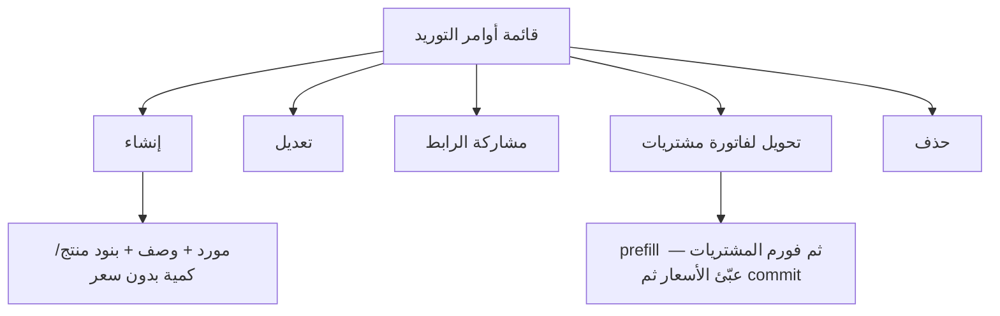

# مواصفة API أوامر التوريد (Supply Orders)

> **الغرض:** مرجع حصرّي لشاشة أوامر التوريد — الوحدة **غير موجودة** في تطبيق الموبايل؛ ابنِها **من الصفر** لتطابق الويب.  
> **الحالة:** ✅ منفّذ على Laravel.  
> **الموردون (إنشاء سريع من الفورم):** [`docs/suppliers-api-spec.md`](suppliers-api-spec.md)  
> **التحويل لفاتورة مشتريات:** [`docs/purchases-api-spec.md`](purchases-api-spec.md)  
> **مرجع عام:** [`docs/mobile-api-parity-spec.md`](mobile-api-parity-spec.md)

**مهم:** مسار الـ API هو `supply-orders` تحت `/api/v1/tenant/shop/`.  
الرابط العام للمتجر `GET /api/v1/store/supply-orders/{no}` للعميل فقط — **لا تستخدمه** داخل شاشات التاجر.

لا تحدّث شاشة قديمة: **لا توجد شاشة**. ابنِ قائمة + إنشاء/تعديل + تفاصيل + إجراءات الصف كوحدة جديدة في مجموعة المشتريات (مثل الويب).

---

## 1) مرجع الويب

| الملف | الدور |
|-------|--------|
| `app/Filament/Tenant/Resources/SupplyOrderResource.php` | قائمة، فورم، مشاركة رابط، تحويل لفاتورة مشتريات، حذف |
| `.../Pages/CreateSupplyOrder.php` | حفظ الرأس ثم البنود |
| `.../Pages/EditSupplyOrder.php` | استبدال كل البنود بعد الحفظ |
| `PurchaseInvoiceResource/Pages/CreatePurchaseInvoice.php` | Prefill من `supply_order_id` |

**API:** `SupplyOrderController` + `SupplyOrderService` — لا تكرّر منطق الحفظ في Flutter.

أمر التوريد **بدون أسعار** (كمية + منتج فقط). الأسعار تُدخل عند تحويله لفاتورة مشتريات.

---

## 2) الفرق: قبل / بعد

| الموضوع | API / التطبيق قبل | الويب + API الحالي |
|---------|-------------------|---------------------|
| شاشة الموبايل | ❌ غير موجودة | وحدة كاملة جديدة: قائمة + إنشاء/تعديل + مشاركة + تحويل لمشتريات + حذف |
| CRUD tenant | ❌ (رابط عام بالمتجر فقط) | `GET/POST/PATCH/DELETE shop/supply-orders` |
| بنود | الاسم والكمية في الرابط العام | `productId`, `productVariantId`, `qty` |
| مشاركة | ❌ | `shareUrl` + `actions.canShare` |
| تحويل لفاتورة مشتريات | ❌ | **`GET .../purchase-prefill`** ثم `POST purchases/commit` (لا تنشئ فاتورة هنا) |
| مسار temp | — | `POST .../start-purchase-invoice` يبقى للتوافق فقط |
| حد الاشتراك | ❌ | نفس `supply_orders` في الويب |
| منتج variants | غير موثّق | `product_variant_id` إلزامي (من `variants[].id`) |

---

## 3) Headers و Base

```
Authorization: Bearer {token}
Tenant-Id: {tenant_id}
Accept: application/json
```

**Base:** `/api/v1/tenant/shop/`  
**Body الطلب:** snake_case  
**JSON الرد:** camelCase  
**تواريخ الفلاتر:** `Y-m-d`  
حقل `date` في الرد `d-m-Y`؛ `createdAt` هو `Y-m-d H:i:s`.

المغلف:

```json
{ "statusCode": 200, "statusText": "success", "message": "...", "data": {}, "errors": [], "locale": "ar" }
```

---

## 4) شاشات الويب → شاشات التطبيق (وحدة جديدة)



**فورم الإنشاء:** رقم مرجعي (يولّده السيرفر)، مورد (مع إنشاء سريع)، وصف إلزامي، بنود: منتج + كمية (1–250000). **بدون سعر، بدون extras، بدون خدمات، بدون دفعات.** الأمر **لا يُقفل** بعد الحفظ (يبقى تعديل/حذف).

**قائمة:** الرقم، اسم المورد، الوصف. بحث على الثلاثة. لا فلاتر في الويب؛ الـ API يضيف `supplier_id` و`from_date`/`to_date` اختيارياً.

### 4.1 إجراءات صف القائمة (مثل الويب)

كل صف يرجع `actions`. **لا تخفِ إجراء موجود في الويب.**

| إجراء الويب | الشرط | ماذا يفعل الموبايل |
|-------------|--------|---------------------|
| مشاركة الرابط | `canShare` | انسخ/افتح `shareUrl` (صفحة عامة `{slug}/supply-orders/{no}`) |
| تحويل لفاتورة مشتريات | `canConvertToPurchaseInvoice` | `GET .../purchase-prefill` ثم فورم المشتريات (`unitCost` فارغ) ثم `POST purchases/commit`. حد فواتير المشتريات يُفحص عند الـ commit |
| تعديل | `canEdit` | `GET` ثم `PATCH` |
| حذف | `canDelete` | `DELETE` بعد تأكيد. يحذف البنود ثم الأمر |

من بطاقة المورد (`GET suppliers/{id}/supply-orders`): مشاركة + تحويل + تعديل. **`canDelete: false`** (الويب لا يحذف من هناك ولا ينشئ أمراً جديداً من بطاقة المورد).

### 4.2 أعلى القائمة

زر إنشاء فقط. معطّل/`400` إذا حد الاشتراك `supply_orders`.

**منتجات الفورم:**  
`POST /api/v1/tenant/shop/list-products-for-advanced-creation` مع `{ "for": "supply_orders" }`.

- تشمل المنتجات حتى بلا سعر بيع (`has('lastPrice')` غير مطلوب).
- `type=basic`: `product_id` + `qty`.
- `type=variants`: اختر من `variants[]` وأرسل `product_variant_id` = `variants[].id`. **لا** تركّب من `selectVariantOptions`. بدون variant → `422`.

---

## 5) Endpoints

| Method | Path | الوصف |
|--------|------|--------|
| `GET` | `supply-orders` | قائمة |
| `POST` | `supply-orders` | إنشاء |
| `GET` | `supply-orders/{id}` | تفاصيل |
| `PUT`/`PATCH` | `supply-orders/{id}` | تعديل (استبدال البنود إذا أُرسلت) |
| `DELETE` | `supply-orders/{id}` | حذف |
| `POST` | `supply-orders/{id}/start-purchase-invoice` | إنشاء فاتورة مشتريات temp من الأمر (legacy) |
| `GET` | `supply-orders/{id}/purchase-prefill` | JSON للتحويل عبر `POST purchases/commit` |
| `GET` | `suppliers/{id}/supply-orders` | قائمة مختصرة من صفحة المورد |

---

## 6) GET — القائمة

```
GET /api/v1/tenant/shop/supply-orders
```

**Query:** `search`, `supplier_id`, `from_date`, `to_date`, `sort`=`latest`\|`oldest`, `paginate`, `per_page`.

```json
{
  "id": 3,
  "no": "10458291",
  "description": "توريد مواد خام",
  "supplierId": 7,
  "date": "16-08-2026",
  "createdAt": "2026-08-16 10:00:00",
  "updatedAt": "2026-08-16 10:00:00",
  "shareUrl": "https://client.example.com/{slug}/supply-orders/10458291",
  "detailsCount": 2,
  "supplier": { "id": 7, "name": "مؤسسة الإمداد" },
  "actions": {
    "canShare": true,
    "canConvertToPurchaseInvoice": true,
    "canEdit": true,
    "canDelete": true
  }
}
```

`items` غير مضمّنة في القائمة (تُحمَّل في show).

---

## 7) POST — إنشاء

```
POST /api/v1/tenant/shop/supply-orders
```

```json
{
  "supplier_id": 7,
  "description": "توريد مواد خام",
  "details": [
    { "product_id": 12, "product_variant_id": null, "qty": 10 },
    { "product_id": 15, "product_variant_id": 44, "qty": 2 }
  ]
}
```

- `no` و `user_id` و `tenant_id` من السيرفر.
- منتج `type=variants` بدون `product_variant_id` (أو `selected_variant_options_ids`) → `422`.
- variant لا يتبع المنتج → `422`.
- إن وصل حد الاشتراك: `400` برسالة `supply_orders_maxed_out_*`.
- `201` + التفاصيل مع `items`.

إنشاء مورد سريع من الفورم: `POST /suppliers` بالاسم فقط ثم استخدم الـ id.

---

## 8) GET — تفاصيل

```
GET /api/v1/tenant/shop/supply-orders/{id}
```

```json
{
  "id": 3,
  "no": "10458291",
  "description": "توريد مواد خام",
  "supplierId": 7,
  "shareUrl": "https://…",
  "supplier": { "id": 7, "name": "مؤسسة الإمداد" },
  "items": [
    {
      "id": 9,
      "name": "أسمنت",
      "qty": 10,
      "productId": 12,
      "productVariantId": null,
      "itemType": "basic"
    }
  ]
}
```

`itemType`: `basic` \| `variants`.

---

## 9) PATCH — تعديل

```
PATCH /api/v1/tenant/shop/supply-orders/{id}
```

نفس حقول الإنشاء (كلها `sometimes`). إذا أُرسل `details` يُحذف القديم ويُحفظ الجديد — مثل الويب.

---

## 10) DELETE

يحذف البنود ثم الأمر. `200`.

---

## 11) تحويل لفاتورة مشتريات

**مثل الويب:** التحويل يفتح فورم فاتورة مشتريات معبّأ بالكميات **بدون أسعار**. المستخدم يعبّئ `unit_cost` + المستودع ثم يؤكد. **لا تُنشأ فاتورة هنا.**

```
GET /api/v1/tenant/shop/supply-orders/{id}/purchase-prefill
```

يرجع `supplierId` والكميات و`unitCost: null` و`taxProfileId`. عبّئ الأسعار + `warehouse_id` ثم `POST /purchases/commit` — انظر [`docs/purchases-api-spec.md`](purchases-api-spec.md).

الأمر بلا بنود: `400`.

حد فواتير المشتريات يُفحص عند `commit` وليس عند الـ prefill.

لا تستخدم `POST .../start-purchase-invoice` في هذه الوحدة الجديدة (مسار temp قديم لفواتير المشتريات).

---

## 12) ما لا تفعله

- لا تفترض وجود شاشة قديمة لأوامر التوريد في الموبايل — ابنِ الوحدة كاملة.
- لا تستخدم `GET /api/v1/store/supply-orders/{no}` داخل شاشات التاجر إلا لمعاينة `shareUrl`.
- لا ترسل أسعار / extras / خدمات / `payment_terms` على أمر التوريد.
- لا تخلط أوامر التوريد مع قائمة فواتير المشتريات.
- لا تستخدم مسار المشتريات temp (`POST purchases` + add-item) عند التحويل — فقط `purchase-prefill` ثم `POST purchases/commit`.

---

## 13) Prompt جاهز لـ Cursor (Flutter)

انسخ هذا البرومبت كما هو:

```
Build a NEW Supply Orders module from scratch. It does NOT exist in the Flutter app. Do not patch an old screen. Single source of truth: docs/supply-orders-api-spec.md. Also read docs/purchases-api-spec.md (convert) and docs/suppliers-api-spec.md (quick-create supplier + supplier card).

Place it in the Purchases section of the app (same as web nav_group_purchases).

Web: Filament SupplyOrderResource — list (no, supplier, description), create/edit (supplier + required description + product qty lines, NO prices/extras/services/payments), share URL, convert to purchase invoice, edit, delete. Orders stay editable after save. No lock.

API base: /api/v1/tenant/shop/
Auth: Bearer + Tenant-Id.
Body snake_case, response camelCase.

Must implement:

A) List GET supply-orders
- Columns: no, supplier name, description.
- Search: no / supplier / description.
- Row actions from data.actions:
  1. Share: copy/open shareUrl.
  2. Convert if canConvertToPurchaseInvoice: GET supply-orders/{id}/purchase-prefill, fill unit_cost + warehouse, POST purchases/commit. Never call start-purchase-invoice.
  3. Edit.
  4. Delete with confirmation.
- Header Create. On 400 show supply_orders subscription limit.

B) Create/Edit
- Server generates no — display after save only.
- supplier required (GET/POST suppliers). description required.
- Lines: POST list-products-for-advanced-creation { "for": "supply_orders" }. Show basic AND variants (including products without sale price). Variants: pick variants[].id as product_variant_id. Each line: product_id, optional product_variant_id, qty 1–250000. NO unit_cost.
- PATCH with details replaces all lines.

C) From supplier view GET suppliers/{id}/supply-orders opens this new module (share, convert, edit). canDelete is false on that compact list.

D) Convert does not create an invoice. Prefill then purchases/commit. Order remains editable.

Dates filters Y-m-d. Response date is d-m-Y; createdAt is Y-m-d H:i:s.
```

---

## 14) QA

| # | سيناريو | المتوقع |
|---|---------|---------|
| 1 | إنشاء بمورد + وصف + بند واحد | `201` + `no` + `shareUrl` + `items` |
| 2 | بدون بنود | `422` على `details` |
| 3 | variant لا يتبع المنتج | `422` |
| 4 | حد الاشتراك | `400` رسالة الحد |
| 5 | تحويل: prefill ثم commit | فاتورة مشتريات مؤكدة بنفس المورد والكميات؛ الأمر ما زال موجوداً |
| 6 | حذف | البنود تُحذف مع الأمر |
| 7 | `shareUrl` | يفتح الصفحة العامة لنفس الرقم |
| 8 | منتج variants بدون `product_variant_id` | `422` |
| 9 | بطاقة المورد | `canDelete: false` |

---

*آخر تحديث: 2026-08-17.*
