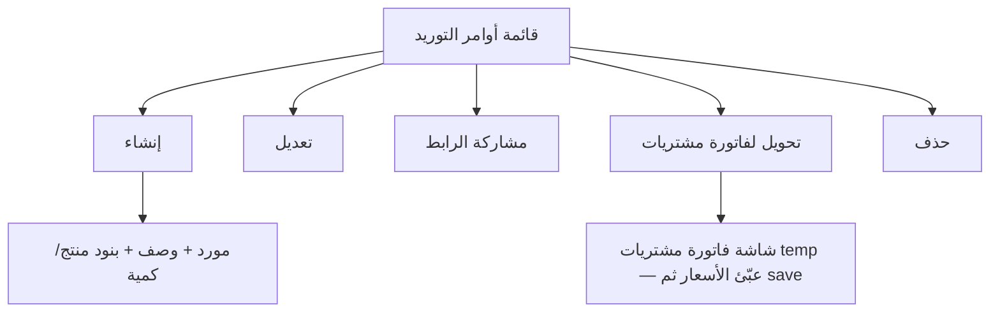

# مواصفة API أوامر التوريد (Supply Orders)

> **الغرض:** مرجع حصرّي لشاشة أوامر التوريد — مواءمة التطبيق مع الويب، ولـ Cursor.  
> **الحالة:** ✅ منفّذ على Laravel.  
> **يكمل:** [`docs/suppliers-api-spec.md`](suppliers-api-spec.md) (بطاقة أوامر التوريد عند المورد).  
> **التحويل لفاتورة:** [`docs/purchases-api-spec.md`](purchases-api-spec.md)

---

## 1) مرجع الويب

| الملف | الدور |
|-------|--------|
| `app/Filament/Tenant/Resources/SupplyOrderResource.php` | قائمة، فورم، مشاركة رابط، تحويل لفاتورة مشتريات، حذف |
| `.../Pages/CreateSupplyOrder.php` | حفظ الرأس ثم البنود |
| `.../Pages/EditSupplyOrder.php` | استبدال كل البنود بعد الحفظ |
| `PurchaseInvoiceResource/Pages/CreatePurchaseInvoice.php` | Prefill من `supply_order_id` |

**API:** `SupplyOrderController` + `SupplyOrderService` — لا تكرّر منطق الحفظ في Flutter.

أمر التوريد **بدون أسعار** (كمية + منتج فقط). الأسعار تُدخل عند تحويله لفاتورة مشتريات.

---

## 2) الفرق: قبل / بعد

| الموضوع | API القديم | الويب + API الحالي |
|---------|------------|---------------------|
| CRUD tenant | ❌ (رابط عام بالمتجر فقط) | `GET/POST/PATCH/DELETE shop/supply-orders` |
| بنود | الاسم والكمية في الرابط العام | `productId`, `productVariantId`, `qty` |
| مشاركة | ❌ | `shareUrl` |
| تحويل لفاتورة مشتريات | ❌ | `POST .../start-purchase-invoice` (فاتورة temp جاهزة للتسعير) |
| حد الاشتراك | ❌ | نفس `supply_orders` في الويب |

---

## 3) Headers و Base

```
Authorization: Bearer {token}
Tenant-Id: {tenant_id}
Accept: application/json
```

**Base:** `/api/v1/tenant/shop/`  
**تواريخ الفلاتر:** `Y-m-d`  
حقل `date` في الرد بقي `d-m-Y` للتوافق مع الرابط العام للمتجر.

---

## 4) شاشات الويب



**فورم الإنشاء:** رقم مرجعي (يولّده السيرفر)، مورد (مع إنشاء سريع)، وصف إلزامي، بنود: منتج + كمية (1–250000). بدون سعر.

**قائمة:** الرقم، اسم المورد، الوصف. بحث على الثلاثة.

**إجراءات الصف:** نسخ/فتح `shareUrl`، تحويل لفاتورة مشتريات، تعديل، حذف (يحذف البنود أولاً).

منتجات الفورم:  
`POST /api/v1/tenant/shop/list-products-for-advanced-creation` مع `{ "for": "supply_orders" }`.

منتج `type=variants`: اختر من `variants[]` وأرسل `product_variant_id` (نفس قائمة المشتريات).

---

## 5) Endpoints

| Method | Path | الوصف |
|--------|------|--------|
| `GET` | `supply-orders` | قائمة |
| `POST` | `supply-orders` | إنشاء |
| `GET` | `supply-orders/{id}` | تفاصيل |
| `PUT`/`PATCH` | `supply-orders/{id}` | تعديل (استبدال البنود إذا أُرسلت) |
| `DELETE` | `supply-orders/{id}` | حذف |
| `POST` | `supply-orders/{id}/start-purchase-invoice` | إنشاء فاتورة مشتريات temp من الأمر (legacy) |
| `GET` | `supply-orders/{id}/purchase-prefill` | JSON للتحويل عبر `POST purchases/commit` |
| `GET` | `suppliers/{id}/supply-orders` | قائمة مختصرة من صفحة المورد |

---

## 6) GET — القائمة

```
GET /api/v1/tenant/shop/supply-orders
```

**Query:** `search`, `supplier_id`, `from_date`, `to_date`, `sort`=`latest`\|`oldest`, `paginate`, `per_page`.

```json
{
  "id": 3,
  "no": "10458291",
  "description": "توريد مواد خام",
  "supplierId": 7,
  "date": "16-08-2026",
  "createdAt": "2026-08-16 10:00:00",
  "updatedAt": "2026-08-16 10:00:00",
  "shareUrl": "https://client.example.com/{slug}/supply-orders/10458291",
  "supplier": { "id": 7, "name": "مؤسسة الإمداد" }
}
```

`items` غير مضمّنة في القائمة (تُحمَّل في show).

---

## 7) POST — إنشاء

```
POST /api/v1/tenant/shop/supply-orders
```

```json
{
  "supplier_id": 7,
  "description": "توريد مواد خام",
  "details": [
    { "product_id": 12, "product_variant_id": null, "qty": 10 },
    { "product_id": 15, "product_variant_id": 44, "qty": 2 }
  ]
}
```

- `no` و `user_id` و `tenant_id` من السيرفر.
- إن وصل حد الاشتراك: `400` برسالة `supply_orders_maxed_out_*`.
- `201` + التفاصيل مع `items`.

إنشاء مورد سريع من الفورم: `POST /suppliers` بالاسم فقط ثم استخدم الـ id.

---

## 8) GET — تفاصيل

```
GET /api/v1/tenant/shop/supply-orders/{id}
```

```json
{
  "id": 3,
  "no": "10458291",
  "description": "توريد مواد خام",
  "supplierId": 7,
  "shareUrl": "https://…",
  "supplier": { "id": 7, "name": "مؤسسة الإمداد" },
  "items": [
    {
      "id": 9,
      "name": "أسمنت",
      "qty": 10,
      "productId": 12,
      "productVariantId": null,
      "itemType": "basic"
    }
  ]
}
```

`itemType`: `basic` \| `variants`.

---

## 9) PATCH — تعديل

```
PATCH /api/v1/tenant/shop/supply-orders/{id}
```

نفس حقول الإنشاء (كلها `sometimes`). إذا أُرسل `details` يُحذف القديم ويُحفظ الجديد — مثل الويب.

---

## 10) DELETE

يحذف البنود ثم الأمر. `200`.

---

## 11) تحويل لفاتورة مشتريات

**المسار المعتمد (شاشات جديدة):** لا تُنشأ فاتورة هنا.

```
GET /api/v1/tenant/shop/supply-orders/{id}/purchase-prefill
```

يرجع المورد والكميات و`unitCost: null`. عبّئ الأسعار ثم `POST /purchases/commit` — انظر [`docs/purchases-api-spec.md`](purchases-api-spec.md).

الأمر بلا بنود: `400`.

**مسار temp القديم (يبقى للتوافق):**

```
POST /api/v1/tenant/shop/supply-orders/{id}/start-purchase-invoice
```

ينشئ فاتورة **temp** (`status=purchase_order`, أسعار 0). بعدها: `update-item` (`unit_cost` ≥ 1) → `save` → `update-status: confirmed`. لا تخلطه مع `commit`.

إذا حد فواتير المشتريات: `400`.

---

## 12) Prompt جاهز لـ Cursor (Flutter)

```
Implement Supply Orders screens to match the MyBee web app using docs/supply-orders-api-spec.md.

Web: Filament SupplyOrderResource — list, create/edit (supplier + description + product qty lines, NO prices), share URL, convert to purchase invoice, delete.

API base: /api/v1/tenant/shop/
Auth: Bearer + Tenant-Id.

Must implement:
1) List: search on no/supplier/description. Actions: share shareUrl, edit, delete, convert.
2) Create/Edit: supplier (search + optional POST /suppliers with name only), description required, line items via POST list-products-for-advanced-creation { "for": "supply_orders" }. Each line: product_id, optional product_variant_id, qty 1–250000. Server generates no.
3) Convert: GET supply-orders/{id}/purchase-prefill, fill unit costs, POST purchases/commit (see docs/purchases-api-spec.md). Do not use start-purchase-invoice in new UI.
4) From supplier view, GET suppliers/{id}/supply-orders can open this module.

Dates filters Y-m-d. Response date is d-m-Y; createdAt is Y-m-d H:i:s.
```

---

## 13) QA

| # | سيناريو | المتوقع |
|---|---------|---------|
| 1 | إنشاء بمورد + وصف + بند واحد | `201` + `no` + `shareUrl` + `items` |
| 2 | بدون بنود | `422` على `details` |
| 3 | variant لا يتبع المنتج | `422` |
| 4 | حد الاشتراك | `400` رسالة الحد |
| 5 | تحويل لفاتورة | فاتورة temp بنفس المورد وعدد البنود، أسعار 0 |
| 6 | حذف | البنود تُحذف مع الأمر |
| 7 | `shareUrl` | يفتح الصفحة العامة لنفس الرقم |

---

*آخر تحديث: 2026-08-16.*
